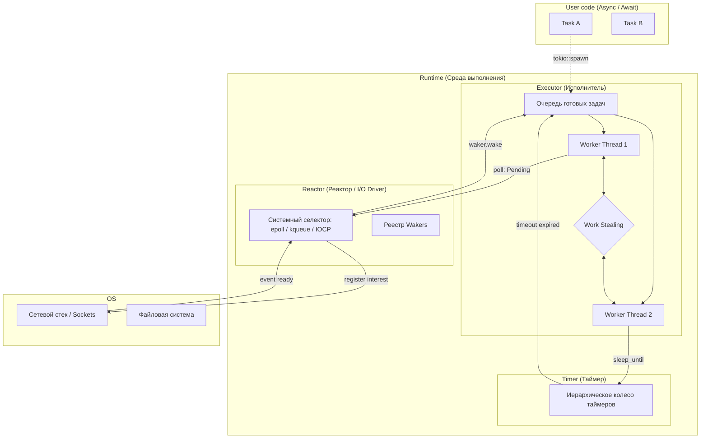

Шаг 3.11: Асинхронный ввод-вывод, фьючерсы (futures) и акторы (actors)
========================================

__Estimated time__: 2 days

В то время как [threads](../3_10_threads) представляют собой решение для проблем, связанных с процессором, для проблем, связанных с вводом-выводом, традиционно решением является [async (non-blocking) I/O][1].


На данный момент в стандартной библиотеке [Rust] нет асинхронных примитивов, поэтому «по умолчанию» ввод-вывод `std` работает синхронно (блокирует текущий [thread][33]). Однако он предоставляет [core abstractions][`std::future`] для их создания, с помощью которых crates экосистемы (например, [`tokio`]) реализуют и предоставляют примитивы для [async I/O][1].


Важно отметить, что асинхронная разработка в [Rust] [все еще][2] [находится в стадии развития][3]. Именно поэтому сейчас все может быть [довольно громоздким][5], часто [вызывая разочарование][6] (особенно, когда дело касается [абстракций][7]). [wg-async][4] (рабочая группа по асинхронной разработке) работает над тем, чтобы сделать это проще, удобнее, эргономичнее и мощнее в будущем.


## `Future`

Основной примитив асинхронного процесса в [Rust] — это [future abstraction][8] (также часто называемая «promise» в некоторых других языках программирования). Существуют две основные концепции, которые отличают [реализацию фьючерсов в Rust][9] от других языков программирования:

1. Фьючерсы [основаны на опросе][10], а не на отправке. Это означает, что после создания фьючерс не будет автоматически выполняться на месте, а должен быть явно выполнен каким-либо исполнителем (средой выполнения/циклом событий для фьючерсов). __Фьючерс ничего не делает, если его не опрашивают__, поэтому обычно представляет собой [ленивое вычисление][12].

2. Futures имеют [нулевая стоимость][11]. Это означает, что код, написанный на фьючерсах, компилируется в нечто эквивалентное (или лучшее), чем «ручная» реализация, которая обычно использует ручные конечные автоматы и тщательное управление памятью.


В [Rust] предоставляются только базовые определения трейтов в модуле [`std::future`]. Чтобы использовать возможности фьючерсов во всей их полноте, рассмотрите возможность использования крейта [`futures`] (и/или аналогичных, таких как [`futures-lite`], [`futures-time`] и т. д.).

Чтобы лучше понять концепции и дизайн [Rust] futures, ознакомьтесь со следующими материалами:
- [Aaron Turon: Zero-cost futures in Rust][11]
- [Aaron Turon: Designing futures for Rust][9]
- [Rust RFC 2592: `futures_api`][13]
- [Asynchronous Programming in Rust: 2.1. The `Future` Trait][20]
- [Conrad Ludgate: Let's talk about this async][14]

Важно отметить, что до стабилизации [дизайна futures][13] в течение довольно длительного времени в экосистеме [Rust] использовался крейт [`futures@0.1`], что привело к тому, что большая часть экосистемы была построена на его основе. К счастью, на данный момент лишь немногие устаревшие или неработающие крейты все еще используют [`futures@0.1`], и, к счастью, их все еще можно использовать одновременно с современной экосистемой на основе [`std::future`] с помощью [слоя совместимости][15].

### `async`/`.await`

[Ключевые слова `async`/`.await`][16] делают асинхронное программирование гораздо более интуитивным, эргономичным и [решают множество проблем с типами и заимствованиями][19] (что может быть довольно сложно при использовании сырых [`futures`]).


> Используйте `async` перед `fn`, `closure` или `block`, чтобы преобразовать помеченный код в `Future`. Таким образом, код не будет выполняться немедленно, а будет оцениваться только после того, как возвращенный `Future` будет выполнен с помощью `.await`.

[Rust] автоматически [превразает асинхронные функции и блоки в функции, возвращающие `Future`][17], применяя правильные [правила пожизненного захвата и исключения][18] для эргономики синтаксиса.


Хотя [ключевое слово `async` пока не поддерживается в методах трейтов][2], существует крейт `async-trait`, который позволяет это сделать для трейтов, преобразуя их в `Future` в блочном формате (главный недостаток которого — непрозрачность по отношению к автотрейтам, таким как `Send`/`Sync`).

Для лучшего понимания принципов работы, десахаризации, использования и особенностей ключевых слов `async`/`.await`, ознакомьтесь со следующей информацией:
- [Rust RFC 2394: `async_await`][16]
- [Asynchronous Programming in Rust: 3. `async`/`.await`][21]
- [Hayden Stainsby: how I finally understood async/await in Rust (part 1)][63]
- [David Tolnay: Await a minute, why bother?][19]
- [Arpad Borsos: Implementation Details of async Rust][27]
- [Tyler Madry: How Rust optimizes async/await I][29]
- [Tyler Madry: How Rust optimizes async/await II: Program analysis][30]


### Задачи и будящий (Tasks and `Waker`)

Помимо самой [будущей абстракции][8], важно понимать, что такое [асинхронная задача][22]:
> Каждый раз, когда опрашивается объект Future, это происходит в рамках «задачи». Задачи — это объекты Future верхнего уровня, которые были переданы исполнителю.

Когда задача приостанавливается из-за ожидания завершения какой-либо неблокирующей операции (это называется «припарковано»), должен существовать способ сообщить исполнителю о необходимости продолжить опрос этой задачи после завершения операции. Объект [`Waker`] (предоставляемый в [`task::Context`]) служит именно этой цели:

> `Waker` предоставляет метод `wake()`, который можно использовать для того, чтобы сообщить исполнителю о необходимости пробуждения связанной с ним задачи. При вызове метода `wake()` исполнитель знает, что задача, связанная с `Waker`, готова к выполнению, и ее будущее следует проверить еще раз.

Чтобы лучше понять дизайн, использование и особенности [`Waker`], ознакомьтесь со следующими материалами:
- [Official `std::task::Waker` docs][`Waker`]
- [Asynchronous Programming in Rust: 2.2. Task Wakeups with `Waker`][22]
- [Hayden Stainsby: how I finally understood async/await in Rust (part 2)][64]
- [Arpad Borsos: Rust Futures and Tasks][28]


### More reading

- [Matt Sarmiento: Async Rust: Futures, Tasks, Wakers—Oh My!][26]
- [Bert Peters: How does async Rust work][31]
- [Tokio Tutorial: Async in depth][24]
- [Asynchronous Programming in Rust][23]
- [Amos: Understanding Rust futures by going way too deep][25]
- [Hayden Stainsby: how I finally understood async/await in Rust (part 4)][67]
- [Saoirse Shipwreckt: Why async Rust?][69]
- [Saoirse Shipwreckt: Let futures be futures][70]
- [Saoirse Shipwreckt: FuturesUnordered and the order of futures][71]


## Async I/O

Асинхронный ввод-вывод в [Rust] возможен благодаря двум основным компонентам: __[неблокирующим операциям ввода-вывода][1]__, предоставляемым операционной системой, и __асинхронной среде выполнения__, которая оборачивает эти операции в удобные асинхронные абстракции и предоставляет [цикл событий][48] для их выполнения и доведения до завершения.


### Non-blocking I/O

Асинхронное программирование невозможно без поддержки [неблокирующего ввода-вывода][1], которая представлена ​​различными [API] в разных операционных системах, например: [epoll] в [Linux] (или многообещающий [io_uring]), [kqueue] в [macOS]/[iOS], [IOCP] в [Windows].


Низкоуровневые крейты, такие как [`mio`] (обеспечивающий работу [`tokio`]) и [`polling`] (обеспечивающий работу [`async-std`]), предоставляют единый многоплатформенный унифицированный интерфейс для большинства этих [API]. Существуют также низкоуровневые крейты, специализированные на конкретном [API], например [`io-uring`].


Для лучшего понимания этой темы, ознакомьтесь со следующими материалами:
- [Official `mio` crate docs][`mio`]
- [Official `polling` crate docs][`polling`]


### Runtime

Высокоуровневые крейты, такие как [`tokio`] (первый и наиболее зрелый на сегодняшний день) и [`async-std`] (не путать с его названием, оно не является официальным и не связано с `std`, это просто название, выбранное авторами), предоставляют не только [реализацию исполнителя][32] для выполнения [`Future`], но и высокоуровневые [API] для [неблокирующего ввода-вывода][1], [таймеров][`tokio::time`] и [примитивов синхронизации][`tokio::sync`] для использования в асинхронных контекстах ([обычные примитивы синхронизации нельзя использовать между точками `.await`][34], поскольку они заблокируют весь исполнитель в его текущем [потоке][33]).


Все асинхронные среды выполнения [Rust] для [`Future`] реализуют идею [кооперативной многозадачности][35], что означает, что задачи (в нашем случае [`Future`]) добровольно передают управление своей среде выполнения (в нашем случае в точках `.await`), в отличие от [вытесняющей многозадачности][36], где среда выполнения может приостанавливать и брать управление обратно, когда ей это нужно (как в [потоках ОС][33] или [виртуальной машине Erlang][37]). Это дает преимущество точного контроля над тем, что и как выполняется, но имеет недостаток, заключающийся в необходимости проявлять большую осторожность в организации [асинхронных задач][22] (например, [избегать блокировки][39] их синхронными или [процессорно-зависимыми] операциями и [передавать управление вручную][38] в занятых циклах).


Также важно классифицировать асинхронные среды выполнения [Rust] следующим образом:

- __Однопоточные среды__ выполнения, __планирующие и выполняющие [`Future`] только в текущем [потоке][33]__, в котором они выполняются.
_Примеры: [`планировщик текущего потока` tokio][40], [`tokio-uring`], [`futures::executor::LocalPool`]_.


- __Многопоточные__ среды выполнения, планирование и выполнение [`Future`] в [пуле потоков][41]:
    - При __[work-stealing][42]__, когда [`Future`] планируются и выполняются на разных [потоках][33]__, так что один [поток][33] может [забрать и выполнить `Future`, изначально запланированный на другом потоке][43], и в результате рабочая нагрузка распределяется более равномерно по стоимости накладных расходов на синхронизацию ([`Future`] необходимо [`Send`]).

      _Примеры: [многопоточный планировщик `tokio`][44], [`async-executor`] из [`async-std`], [`futures::executor::ThreadPool`]_.

    - Использование модели __[поток на ядро][45]__, где [`Future`] планируются на разных [потоках][33], но никогда не покидают свой [поток][33] до полного выполнения__, и таким образом избегаются любые накладные расходы на синхронизацию ([`Future`] не обязательно будут[`Send`]).

      _Примеры: [`actix-rt`], построенный на основе нескольких планировщиков текущих потоков [`tokio`][40], [`glommio`]_.


К сожалению, на данный момент в [Rust] нет эффективного способа абстрагироваться от нескольких асинхронных сред выполнения. Поэтому авторы библиотек, использующих [неблокирующий ввод-вывод][1], либо придерживаются только одной конкретной среды выполнения ([`tokio`], в основном), либо поддерживают несколько сред выполнения с помощью [функций Cargo][46].


Для лучшего понимания этой темы, ознакомьтесь со следующими материалами:
- [Official `tokio` crate docs][`tokio`]
- [Official `async-std` crate docs][`async-std`]
- [Tokio Tutorial][47]
- [Nick Cameron: What is an async runtime?][59]
- [Sylvain Kerkour: Async Rust: Cooperative vs Preemptive scheduling][60]
- [Sylvain Kerkour: Async Rust: What is a runtime? Here is how tokio works under the hood][61]
- [Hayden Stainsby: how I finally understood async/await in Rust (part 3)][65]
- [Ibraheem Ahmed: Learning Async Rust With Entirely Too Many Web Servers][66]
- [Saoirse Shipwreckt: Thread-per-core][68]
- [Milos Gajdos: Rust tokio task cancellation patterns][72]


## Actors

[Модель акторов][49] — это еще одна очень распространенная и известная [парадигма параллельного программирования][50]. Она довольно хорошо подходит для решения основных задач параллельной коммуникации, поэтому многие языки приняли ее в качестве своей основной [парадигмы параллельного программирования][50] (самые известные реализации — [Akka][51] и [Erlang][52]).


> [Модель акторов][53] была предложена [Карлом Хьюиттом] в 1973 году и основана на философии, согласно которой всё является актором. Это похоже на философию «всё является объектом», используемую в некоторых объектно-ориентированных языках программирования.
>
> Это по своей сути асинхронный процесс: отправитель сообщения не блокирует отправку, независимо от того, готов ли получатель получить сообщение из почтового ящика или нет; вместо этого сообщение помещается в очередь, обычно называемую «почтовым ящиком». Это удобно, но несколько сложнее для понимания, и почтовые ящики потенциально должны вмещать большое количество сообщений.
>
> Каждый процесс имеет один почтовый ящик; сообщения отправляются отправителем в почтовый ящик получателя, а получатель их извлекает.

Она в некоторой степени очень похожа на модель [Communicating Sequential Processes (CSP)][54] и взаимозаменяема с ней, поскольку работает на том же уровне абстракции, но основное [различие][55] можно описать следующим образом:

> [Модель акторов][49] представляет идентифицируемые процессы (акторов) с неидентифицируемой коммуникацией (доставкой сообщений), тогда как [модель CSP][54] представляет неидентифицируемые процессы с идентифицируемой коммуникацией (каналами). Для доставки сообщения в [модели акторов][49] мы должны «назвать» актора, тогда как в [модели CSP][54] мы должны «назвать» канал.


В [Rust] [абстракция актора][49] __в основном полезна для выражения некоторого долгоживущего состояния__ для взаимодействия (например, [фоновый рабочий процесс][56] или [соединение WebSocket][57]).


Самая известная реализация [акторов][49] в [Rust] — это [`actix`]. В момент её разработки она также служила __связующим звеном для объединения синхронных и асинхронных миров__, предоставляя как синхронные, так и асинхронные реализации [акторов][49]. Однако сегодня использование [`spawn_blocking()`][39] обычно является более удобной альтернативой.


[`quickwit-actors`] — это еще одна простая реализация [actors][49], обладающая собственными преимуществами, созданная [специально для нужд Quickwit][62].


Более универсальные и сложные реализации [системы акторов][49] (подобные [Akka]) — это [`bastion`], [`riker`] и [`hydra`].


Чтобы лучше понять дизайн, концепции, использование и реализацию [актеров][49], прочтите следующее:
- [Karan Pratap Singh: CSP vs Actor model for concurrency][55]
- [Official `actix` crate docs][`actix`]
- [Official `actix` user guide][58]
- [Evance Soumaoro: Efficient indexing with Quickwit Rust actor framework][62]


## More reading

- [Nazmul Idris: Build with Naz: Rust async, non-blocking, concurrent, parallel, event loops, graceful shutdown][73]
- [Willem Vanhulle: Functional async][74]


## Task

Implement an async-driven [CLI] tool, which downloads specified web pages:
```bash
cargo run -p step_3_11 -- [--max-threads=<number>] <file>
```
It must read a list of links from the `<file>`, and then concurrently download a content of each link into a separate `.html` file (named by a link).

`--max-threads` argument must control the maximum number of _simultaneously running threads_ in the program (should default to CPUs number).


## Questions


После выполнения всех вышеперечисленных действий вы должны уметь ответить (и понять, почему) на следующие вопросы:

- [Что такое асинхронное программирование? Как оно связано с многопоточностью? Какие проблемы оно решает? Каковы предпосылки для его существования?](#что-такое-асинхронное-программирование-как-оно-связано-с-многопоточностью-какие-проблемы-оно-решает-каковы-предпосылки-для-его-существования)

- [Как работает неблокирующий ввод-вывод? Чем он отличается от блокирующего ввода-вывода?](#как-работает-неблокирующий-ввод-вывод-чем-он-отличается-от-блокирующего-ввода-вывода)

- [Что такое `Future`? Зачем он нам нужен? Как он работает в Rust и чем его семантика отличается от других языков программирования? Что делает его нулевым по стоимости?](#что-такое-future-зачем-он-нам-нужен-как-он-работает-в-rust-и-чем-его-семантика-отличается-от-других-языков-программирования-что-делает-его-нулевым-по-стоимости)

- [Что такое `async`/`.await`? Как они преобразуют `future` в `future`? Почему они так важны для эргономики?](#что-такое-asyncawait-как-они-преобразуют-future-в-future-почему-они-так-важны-для-эргономики)

- [Что такое асинхронная задача? Чем она отличается от `Future`?](#что-такое-асинхронная-задача-чем-она-отличается-от-future)


- [Что такое `Waker`? Как он работает? Зачем он нужен?](#что-такое-waker-как-он-работает-зачем-он-нужен)

- [Что такое асинхронная среда выполнения? Из каких частей она обычно состоит?](#что-такое-асинхронная-среда-выполнения-из-каких-частей-она-обычно-состоит)

- [Какой тип многозадачности представлен `Future` в Rust? Какие у них преимущества и недостатки?](#какой-тип-многозадачности-представлен-future-в-rust-какие-у-них-преимущества-и-недостатки)

- [Какие типы асинхронных сред выполнения существуют в Rust для многопоточности? Каковы преимущества и недостатки каждой из них?](#какие-типы-асинхронных-сред-выполнения-существуют-в-rust-для-многопоточности-каковы-преимущества-и-недостатки-каждой-из-них)

- [Почему блокировка в асинхронной среде выполнения — это плохо? Как этого избежать на практике?](#почему-блокировка-в-асинхронной-среде-выполнения--это-плохо-как-этого-избежать-на-практике)


- What are the key points of actor model concurrency paradigm? How may it be useful in [Rust]?
- [В чём заключаются ключевые моменты парадигмы параллельного выполнения в рамках модели акторов? Какую пользу она может принести в Rust?]()

<hr>

### Что такое асинхронное программирование? Как оно связано с многопоточностью? Какие проблемы оно решает? Каковы предпосылки для его существования?

Асинхронное программирование в Rust — это парадигма, позволяющая одному потоку процессора одновременно управлять множеством задач, которые большую часть времени чего-то ждут (сеть, диск, таймер).

#### 1. Что это такое?

В основе лежат Future (будущие значения). Когда вы вызываете асинхронную функцию, она не выполняет работу сразу, а возвращает «обещание» выполнить её позже.

- __Ключевые слова__: async (помечает блок/функцию как ленивую) и await (приостанавливает текущую задачу, пока результат не будет готов, отдавая управление другим задачам).

#### 2. Как это связано с многопоточностью?

Асинхронность и многопоточность — это разные, но дополняющие друг друга инструменты:

- __Многопоточность (Parallelism)__: У вас есть 4 повара (ядра CPU), каждый делает свою работу. Это дорого (каждый поток потребляет ~2 МБ памяти на стек).
- __Асинхронность (Concurrency)__: У вас есть 1 повар, который поставил чайник и, пока тот закипает, режет салат. Он не ждет чайник, он переключает контекст.
- __Связь__: В Rust асинхронные задачи (Tasks) обычно работают внутри пула потоков (например, Tokio). Один поток может по очереди выполнять тысячи асинхронных задач.

#### 3. Какие проблемы оно решает?

- Проблема масштабируемости (C10k): Обычная многопоточность плохо справляется, если у вас 10 000 одновременных соединений (нужно 10 000 потоков ОС, что перегрузит планировщик). Асинхронный Rust может обрабатывать миллионы соединений на нескольких потоках.
- Эффективное использование ресурсов: Пока программа ждет ответа от базы данных, процессор не «спит» в пустом цикле, а выполняет полезную работу для других пользователей.
- Упрощение сложной логики ожидания: Вместо запутанных «колбэков» (callback hell), вы пишете код, который выглядит как последовательный.

#### 4. Предпосылки появления

- Разрыв в скорости CPU и I/O: Процессоры стали невероятно быстрыми, а сеть и диски — всё еще медленные. Тратить целое ядро на ожидание одного сетевого пакета стало непозволительной роскошью.
- Облачные вычисления: В AWS/Azure вы платите за количество ядер и память. Асинхронный код позволяет упаковать в 10 раз больше логики на тот же сервер.
- Rust Ownership: Rust идеально подошел для асинхронности, так как его система владения гарантирует, что данные, которые использует задача, не будут удалены, пока она «спит» (через лайфтаймы и Arc).

#### Сводная таблица

|Критерий|Потоки (std::thread)|Асинхронность (async/await)|
|--------|--------------------|---------------------------|
|Вес задачи|Тяжелая (~2 МБ памяти)|Крошечная (десятки байт)|
|Переключение|Медленное (делает ОС)|Мгновенное (делает рантайм)|
|Для чего|Тяжелые вычисления (CPU)|Сеть, БД, Веб-серверы (I/O)|

__Итог__: Асинхронность в Rust — это способ делать больше, используя меньше ресурсов.

<hr>

### Как работает неблокирующий ввод-вывод? Чем он отличается от блокирующего ввода-вывода?

В Rust разница между блокирующим и неблокирующим вводом-выводом (I/O) — это разница между программой, которая «стоит в очереди», и программой, которая «берет номерок с вибросигналом» и идет заниматься другими делами.

#### 1. Блокирующий ввод-вывод (Синхронный)

Когда вы вызываете функцию вроде std::fs::read или TcpStream::read, поток останавливается операционной системой.

- Процесс: Поток переходит в состояние «сна». Он потребляет память (~2 МБ на стек), но 0% ресурсов процессора, пока ждет данные с диска или из сети.
- Подвох: Если вы хотите обрабатывать 1000 одновременных пользователей, вам нужно 1000 потоков. Это приводит к огромным накладным расходам на переключение контекста (Context Switching), когда процессор тратит больше времени на замену потоков, чем на саму работу.

#### 2. Неблокирующий ввод-вывод (Асинхронный)

Неблокирующий I/O (работающий на базе Tokio или mio) говорит ОС: «Начни читать эти данные. Если они еще не готовы, не останавливай меня; просто скажи мне вернуться позже».

- __Механизм («Номерок»)__: Rust использует системные примитивы, такие как epoll (Linux), kqueue (macOS) или IOCP (Windows). ОС ведет список «событий» и уведомляет программу только тогда, когда данные действительно доступны.
- __Паттерн Reactor__: Небольшое количество потоков (обычно равное количеству ядер CPU) запускает Цикл событий (Event Loop). Они мгновенно перепрыгивают с одной задачи на другую, как только приходят данные.

#### 3. Ключевые различия

|Характеристика|Блокирующий (std::io)|Неблокирующий (tokio::io)|
|--------------|---------------------|-------------------------|
|Поведение потока|Останавливается и ждет.|Отдает управление (Приостанавливается).|
|Масштабируемость|Низкая (лимит RAM/потоков).|Высокая (миллионы соединений).|
|Сложность|Простой линейный код.|Требует async/await и Runtime.|
|Эффективность|Хороша для одиночных тяжелых задач.|Идеальна для множества легких задач.|

#### 4. Как это работает в Rust: Машина состояний

Когда вы пишете socket.read().await, компилятор Rust превращает ваш код в Машину состояний (State Machine):

  1. Задача пытается прочитать данные.
  2. Если ОС отвечает «EWOULDBLOCK» (не готово), задача регистрирует себя в Реакторе и возвращает Poll::Pending.
  3. Поток теперь свободен для обработки других запросов.
  4. Когда сетевой пакет приходит, Реактор «будит» задачу, и она возобновляет работу ровно с того места, где остановилась.

#### 5. Почему Rust здесь уникален

В отличие от Go или Java, где рантайм управляет «зелеными потоками», Rust использует __Zero-Cost Futures__ (фьючерсы с нулевой стоимостью):

- Нет никакой скрытой фоновой работы.
- Если вы не используете async, вы за него не платите (ни памятью, ни размером файла).
- Машина состояний, генерируемая компилятором, так же эффективна, как если бы вы написали её вручную на C.

Совет профессионала: Никогда не выполняйте блокирующий I/O (например, std::fs) внутри асинхронной функции (Tokio). Это «заморит голодом» исполнитель (executor), и все остальные задачи в этом потоке просто перестанут работать!

<hr>

### Что такое `Future`? Зачем он нам нужен? Как он работает в Rust и чем его семантика отличается от других языков программирования? Что делает его нулевым по стоимости?

В Rust Future — это фундамент всей асинхронной экосистемы. Понимание его устройства объясняет, почему Rust считается одним из самых быстрых языков для сетевого программирования.

#### 1. Что такое Future?

__Future__ — это значение, которое еще не готово, но будет вычислено в будущем. В Rust это трейт, который описывает объект, способный продвигаться к завершению.

- Зачем он нужен? Чтобы позволить программе выполнять другую работу (например, отвечать на второй запрос), пока первая задача ждет ответа от базы данных или сети.

#### 2. Как он работает в Rust? (Модель опроса)

Это ключевой момент. В большинстве языков (JS, C#, Python) используется модель уведомлений (Push): вы создаете Promise, он начинает выполняться в фоне, а когда закончит — вызовет колбэк.

В Rust используется модель опроса (__Pull__):

  1. Future сама по себе ничего не делает (она ленива).
  2. Специальная сущность — Executor (исполнитель, например, Tokio) — вызывает метод .poll().
  3. Если данные готовы, Future возвращает Poll::Ready(result).
  4. Если данные не готовы (ждем сеть), она возвращает Poll::Pending и «засыпает».

#### 3. Чем семантика Rust отличается от других языков?

|Характеристика|JavaScript / C# / Go|Rust|
|--------------|--------------------|----|
|Характеристика|JavaScript / C# / Go|Rust|
|Запуск|Сразу при создании (Eager).|Только при вызове await или spawn (Lazy).|
|Управление|Скрытый рантайм внутри языка.|Рантайм — это внешняя библиотека (Tokio).|
|Память|Часто аллокация в куче (Heap).|Может жить полностью на стеке.|
|Отмена|Сложно (нужны CancellationToken).|Мгновенно (просто уничтожьте объект Future).|

#### 4. Почему это «Нулевая стоимость» (Zero-Cost)?

Фраза «Zero-Cost» в Rust означает, что вы не смогли бы написать это вручную на C эффективнее. Вот за счет чего это достигается:

  1. Нет скрытых аллокаций: В JS каждый async вызов создает объект в куче. В Rust компилятор вычисляет размер всех Future заранее и упаковывает их в одну компактную Машину состояний (State Machine) [2.1].
  2. Нет фоновых потоков по умолчанию: В Go каждая "горутина" имеет свой стек (~2 КБ). В Rust тысячи Future могут работать внутри одного потока, не требуя выделения памяти под стек для каждой.
  3. Статическая диспетчеризация: Компилятор агрессивно оптимизирует вызовы .poll(), часто превращая сложную цепочку асинхронных вызовов в простой набор инструкций процессора.

#### 5. Механизм Waker (Пробуждение)

Чтобы Executor не опрашивал Future в бесконечном цикле (тратя CPU), существует Waker.

Когда сетевая карта получает пакет, она посылает сигнал, который через цепочку вызовов доходит до Waker. Тот говорит Исполнителю: «Эй, задача №5 готова, вызови её .poll() еще раз!».

<hr>

### Что такое `async`/`.await`? Как они преобразуют `future` в `future`? Почему они так важны для эргономики?

В Rust async и .await — это синтаксический сахар, который превращает сложную ручную работу с машинами состояний в читаемый, линейный код.

#### 1. Что такое async?

Ключевое слово async (перед fn или блоком {}) превращает обычный кусок кода в генератор Future.

- Трансформация: Когда вы помечаете функцию как async, компилятор переписывает её возвращаемое значение. Вместо T функция теперь возвращает анонимный тип, реализующий 
```rust 
Future<Output = T>
```
- Ленивость: Код внутри async блока не выполняется при вызове функции. Он просто упаковывается в структуру данных (машину состояний) и ждет первого опроса (poll).

#### 2. Что такое .await?

Это механизм уступки управления (yielding). Когда вы вызываете .await внутри асинхронной функции:

  1. Она проверяет, готов ли результат целевой Future.
  2. Если готов — выполнение продолжается дальше.
  3. Если не готов (Pending) — текущая Future возвращает управление исполнителю (например, Tokio), позволяя ему заняться другими задачами.

#### 3. Как они преобразуют Future в Future?

Это концепция композиции. Асинхронная функция сама является Future, и внутри себя она «опрашивает» другие Future.

- __Машина состояний__: Компилятор анализирует все точки .await в вашей функции и создает перечисление (enum), где каждое состояние — это промежуток между двумя .await.
- __Сохранение контекста__: Все локальные переменные, которые должны «пережить» ожидание, сохраняются внутри этой структуры. Это позволяет задаче «уснуть» и «проснуться» с теми же данными.

#### 4. Почему это важно для эргономики?

До появления async/.await программисты писали «ад колбэков» (callback hell) или вручную реализовывали трейт Future, что требовало сотен строк шаблонного кода.

Преимущества для разработчика:

  1. Линейный вид: Код выглядит так, будто он синхронный. Вы читаете его сверху вниз, несмотря на то что под капотом происходят тысячи прерываний и переключений.
  2. Обработка ошибок: Вы можете использовать обычный оператор ? для проброса ошибок в асинхронном коде.
  3. Заимствования (Borrowing): Компилятор Rust проверяет безопасность ссылок через точки .await. Это сложнейшая инженерная задача, которую async/.await решает автоматически.
  4. Структурная конкурентность: Вы можете запустить несколько Future одновременно (например, через tokio::join!) и дождаться их всех одной строкой.

#### Сравнение

|Без async/.await (Вручную)|С async/.await|
|--------------------------|--------------|
|Нужно самому писать match poll() { ... }.|Достаточно дописать .await.|
|Нужно вручную хранить переменные в struct.|Переменные хранятся автоматически.|
|Сложно обрабатывать лайфтаймы ссылок.|Компилятор проверяет ссылки за вас.|

__Итог__: async/.await делает асинхронное программирование на Rust безопасным и доступным, сохраняя при этом производительность системного уровня.

<hr>

### Что такое асинхронная задача? Чем она отличается от `Future`?

В Rust различие между задачей (Task) и Future — это разница между «процессом выполнения» и «куском кода».

#### 1. Что такое Future? (Пассивный объект)

__Future__ — это просто структура данных, созданная компилятором. Она ленива (lazy).

- __Состояние__: Это машина состояний, которая хранит текущий прогресс выполнения и локальные переменные.
- __Действие__: Она ничего не делает сама по себе. Если вы просто вызовете асинхронную функцию и не примените к ней .await или не передадите исполнителю, код внутри неё никогда не выполнится.

#### 2. Что такое Задача (Task)? (Активная единица)

__Задача (Task)__ — это «запущенная» Future. Это аналог «потока», но на уровне асинхронного рантайма (например, Tokio).

- Создание: Задача появляется, когда вы передаете Future исполнителю с помощью функции tokio::spawn.
- Жизненный цикл: Как только задача создана, рантайм берет на себя ответственность за её опрос (poll) до самого завершения. Она становится независимой от того места, где была создана.

#### Ключевые отличия

|Характеристика|Future|Задача (Task)|
|Активность|Пассивна (ждет, когда её опросят).|Активна (выполняется рантаймом).|
|Владение|Принадлежит тому, кто её вызвал.|Автономна (управляется планировщиком).|
|Параллелизм|Выполняется последовательно в .await.|Может выполняться параллельно в пуле потоков.|
|Тип|Конкретный тип/структура в Rust.|Абстрактная единица исполнения.|

#### Аналогия из реального мира

- Future — это рецепт блюда. Он лежит на столе (в памяти) и описывает, что нужно делать. Но сам по себе он не превратится в еду.
- Задача (Task) — это повар, который взял рецепт и начал готовить. Он будет резать овощи, пока закипает вода, и доведет дело до конца.

#### Почему это важно?

  1. __.await не создает задачу__: Когда вы пишете foo().await, вы просто выполняете одну Future внутри другой. Это все еще одна задача.
  2. __tokio::spawn создает задачу__: Это позволяет запустить код «в фоне». Если основная программа пойдет дальше, задача продолжит выполняться на другом ядре процессора.
  3. __Отмена__: Если вы удалите (drop) Future, она мгновенно остановится. Если вы хотите остановить задачу, вам нужен её JoinHandle для принудительного прерывания.

__Итог__: Используйте Future для последовательных шагов внутри одной логики, и Задачи — для независимых параллельных действий.

<hr>

### Что такое `Waker`? Как он работает? Зачем он нужен?

В Rust Waker — это «будильник» асинхронной системы. Он служит мостом между Реактором (который замечает, что событие, например сетевой пакет, пришло) и Исполнителем (Executor), который запускает ваш код.

```text
Reactor -> Waker -> Executor
```

#### 1. Что такое Waker?

Waker — это дескриптор (умный указатель), который используется для уведомления Исполнителя о том, что конкретная Задача (Task) теперь готова продолжить выполнение.

#### 2. Зачем он нужен?

Без Waker Исполнителю пришлось бы опрашивать (poll) каждый Future в бесконечном цикле, чтобы проверить, не завершились ли они.

- __Проблема__: Если у вас 1 000 000 соединений, постоянный опрос поглотил бы 100% ресурсов процессора только на саму «проверку».
- __Решение__: Исполнитель отправляет Future «спать». Waker гарантирует, что Исполнитель разбудит задачу только тогда, когда для неё действительно появится работа.

#### 3. Как это работает? (Жизненный цикл)

Процесс работы Waker состоит из следующих шагов:

- __Опрос (Polling)__: Исполнитель вызывает poll(cx) у Future. Аргумент cx (контекст) содержит в себе Waker.
- __Ожидание (Pending)__: Если данные (например, из сокета) еще не готовы, Future клонирует Waker и сохраняет его где-нибудь (обычно внутри Реактора или обработчика прерываний).
- __Сон__: Future возвращает Poll::Pending. Исполнитель перестает её выполнять и переходит к другим задачам.
- __Внешнее событие__: Приходит сетевой пакет. ОС или Реактор видит это и находит сохраненный Waker.
- __Пробуждение__: Реактор вызывает метод waker.wake().
- __Повторный опрос__: Этот сигнал говорит Исполнителю: «Помести эту конкретную задачу обратно в очередь 'Готовых'». Вскоре Исполнитель снова вызовет её метод poll().

#### 4. Технические детали: RawWaker и VTable

Под капотом Waker — это абстракция с нулевой стоимостью, разработанная для сред no_std (embedded):

- Он использует VTable (таблицу виртуальных методов), чтобы разные рантаймы (Tokio, async-std или ваша собственная ОС) могли определить, как именно задача должна быть разбужена.
- Он является потокобезопасным (Send + Sync), что позволяет аппаратному прерыванию или другому потоку безопасно разбудить задачу, работающую в другом месте.

#### 5. Сводная таблица

|Понятие|Роль|
|-------|----|
|Future|Машина состояний (Логика задачи).|
|Executor|Двигатель, который вызывает .poll().|
|Waker|Сигнал, инициирующий новый вызов .poll().|
|Reactor|Часть, которая ждет событий ОС и вызывает .wake().|

#### Почему это «Нулевая стоимость»:

Если задача ждет 10 секунд, она потребляет ноль циклов процессора. Она существует лишь как несколько байт в памяти, пока не сработает Waker.

<hr>

### Что такое асинхронная среда выполнения? Из каких частей она обычно состоит?

В Rust асинхронная среда выполнения (Runtime) — это библиотека, которая берет на себя управление жизненным циклом асинхронных задач.

В отличие от многих языков (Go, JavaScript), в Rust нет встроенного рантайма внутри самого языка. Это сделано для того, чтобы Rust мог работать везде: от мощных серверов до крошечных микроконтроллеров без ОС.

#### Из каких частей состоит Runtime?

Типичный асинхронный рантайм (например, Tokio) состоит из трех основных компонентов:

1. Executor (Исполнитель)

Это «сердце» рантайма.

  - Worker Threads: Пул потоков (обычно по числу ядер CPU), которые вызывают .poll() у задач.
  - Work Stealing: Если один поток разгреб свою очередь, он «крадет» задачи у соседа, чтобы процессор не простаивал.
  - Функция: Он берет ваши Future и вызывает у них метод .poll().
  - Уровни: Обычно состоит из планировщика (Scheduler), который распределяет задачи между потоками процессора (используя алгоритм work-stealing), и очереди задач.
  - Цель: Максимально плотно загрузить ядра CPU полезной работой.


2. Reactor (Реактор)

Связующее звено с ОС.

  - Poller: Использует быстрые системные вызовы для мониторинга тысяч сокетов одновременно.
  - Wakers: Когда данные приходят из ОС, Реактор находит нужный Waker и отправляет задачу обратно в Очередь готовых задач Исполнителя.
  - Функция: Когда задача говорит: «Я жду пакет из сети», Реактор регистрирует этот запрос в ОС (через epoll, kqueue или IOCP).
  - События: Как только данные приходят, Реактор находит соответствующий Waker и подает сигнал Исполнителю: «Эта задача готова, проснись!».


3. Timer (Таймер)

Специализированная структура данных для управления временем.

  - Wheel: Использование «колеса таймеров» (hashed wheel timer) позволяет эффективно управлять миллионами таймаутов одновременно, не перегружая процессор.
  - Функция: Позволяет эффективно «усыплять» задачи на определенный срок без создания для каждой отдельного потока в ОС.
  - Важность: В высоконагруженных системах (например, обработка таймаутов) таймер должен быть экстремально быстрым, так как событий может быть миллионы.


#### Жизненный цикл события:

  1. Задача пытается прочитать из сокета и получает Pending.
  2. Реактор запоминает этот сокет.
  3. Исполнитель переключается на другую задачу.
  4. ОС уведомляет Реактор, что данные пришли.
  5. Реактор «будит» задачу через Waker.
  6. Исполнитель снова вызывает .poll(), и на этот раз задача завершается успехом.

#### Популярные среды выполнения

|Рантайм|Назначение|
|-------|----------|
|Tokio|Стандарт индустрии. Самый мощный, быстрый и многофункциональный. Идеален для серверов.|
|async-std|Библиотека, стремящаяся быть асинхронным аналогом стандартной библиотеки Rust.|
|smol|Компактный и быстрый рантайм, состоящий из маленьких независимых крейтов.|
|embassy|Специализированный рантайм для микроконтроллеров (embedded), работающий без динамической памяти|

#### Почему это важно для вас?

Когда вы используете async/await, вы просто описываете что нужно сделать. Но чтобы код начал выполняться, вам нужно запустить его внутри рантайма:

```rust
#[tokio::main] // Это макрос запускает Runtime Tokio
async fn main() {
    let data = fetch_data().await;
    println!("{:?}", data);
}
```

1. Использование Runtime (Явное создание)

Если вы хотите запустить асинхронный код из обычной синхронной функции main, вам нужно вручную создать экземпляр рантайма Tokio и вызвать метод block_on.

```rust
use tokio::runtime::Runtime;

fn main() {
    // 1. Создаем многопоточный рантайм (Multi-thread)
    let rt = Runtime::new().unwrap();

    // 2. Блокируем текущий поток до завершения асинхронной задачи
    rt.block_on(async {
        let data = fetch_data().as_ref();
        println!("{:?}", data);
    });
}
```

2. Использование Builder (Тонкая настройка)

Если вам нужен только один поток (например, для простых утилит), используйте current_thread.

```rust
use tokio::runtime::Builder;

fn main() {
    let rt = Builder::new_current_thread()
        .enable_all() // Включает таймеры и сетевой драйвер (Реактор)
        .build()
        .unwrap();

    rt.block_on(fetch_data());
}
```

__Итог__: Runtime — это невидимый дирижер. Исполнитель дает задачи музыкантам (потокам), Реактор следит за нотами (I/O), а Таймер задает темп.

#### Архитектура Async Runtime



<hr>

### Какой тип многозадачности представлен `Future` в Rust? Какие у них преимущества и недостатки?


В Rust многозадачность, реализуемая через Future, классифицируется как __кооперативная многозадачность__ (Cooperative Multitasking).

Это принципиально отличается от __вытесняющей многозадачности__ (Preemptive Multitasking), которую использует операционная система для управления обычными потоками (std::thread).

#### 1. Как это работает?

В кооперативной модели задача сама решает, когда ей «уступить» место другим.

- Когда вы пишете .await, вы создаете точку приостановки.
- Если данные не готовы, Future возвращает управление Исполнителю (Executor).
- Исполнитель берет следующую готовую задачу из очереди.

#### 2. Преимущества кооперативной многозадачности в Rust

1. Легковесность (Масштабируемость):

    Обычный поток ОС требует ~2 МБ стека. Асинхронная задача — это просто структура данных в памяти (от нескольких десятков байт). Это позволяет запускать миллионы задач на одном сервере.

2. Дешевое переключение контекста:

    Переключение между потоками ОС — дорогая операция (нужен переход в режим ядра). Переключение между Future — это просто вызов функции в пользовательском пространстве, что в десятки раз быстрее.

3. Контроль над ресурсами:

    Вы сами выбираете среду выполнения (Runtime). Можно запустить всё на одном ядре (для экономии) или распределить на все ядра (для скорости).

4. Безопасная отмена:

    Поскольку Future — это просто объект, её можно «отменить», просто удалив его из памяти (drop). В обычных потоках безопасная принудительная остановка практически невозможна.

#### 3. Недостатки и риски

  1. Проблема «Жадности» (Blocking):

      Если вы запустите тяжелое вычисление (например, loop { ... } или std::thread::sleep) внутри асинхронной функции, она никогда не вернет управление. Все остальные задачи в этом потоке «зависнут». В кооперативной модели один «плохой» участник может остановить весь сервер.

  2. Сложность отладки:

      Стек вызовов (stack trace) в асинхронном коде гораздо труднее читать, так как задача постоянно прерывается и возобновляется.

  3. Фрагментация экосистемы:

      Вам нужно выбирать библиотеки, которые поддерживают async. Вы не можете просто использовать блокирующий драйвер БД внутри асинхронного цикла без накладных расходов.

#### Сводное сравнение

|Характеристика|Вытесняющая (Threads)|Кооперативная (Future)|
|--------------|---------------------|----------------------|
|Кто управляет?|Операционная система (Kernel).|Библиотека-рантайм (Tokio).|
|Когда прерывать?|В любой момент (таймером ОС).|Только в точках .await.|
|Эффективность I/O|Низкая (потоки простаивают).|Максимальная.|
|Сложность кода|Низкая.|Выше (нужно следить за блокировками).|

__Главный вывод__: Кооперативная многозадачность идеальна для I/O-bound задач (веб-серверы, прокси, чаты). Для __CPU-bound__ задач (рендеринг, архивация) лучше подходит обычный параллелизм потоков (Rayon).

<hr>

### Какие типы асинхронных сред выполнения существуют в Rust для многопоточности? Каковы преимущества и недостатки каждой из них?

В Rust выбор асинхронной среды выполнения (Runtime) зависит от того, как она управляет потоками. Существует два основных архитектурных подхода к многопоточности в асинхронной среде: Work-Stealing (Многопоточный) и Single-Threaded / Thread-per-Core (Однопоточный на ядро).


#### 1. Многопоточный рантайм с «кражей задач» (Work-Stealing)

Это стандарт для большинства серверных приложений. Самый яркий представитель — __Tokio__ в режиме multi_thread.

  - Как это работает: Рантайм запускает пул потоков (обычно по числу ядер). Если один поток разгреб свою очередь задач, он «крадет» задачи из очередей других, менее свободных потоков.
  - Преимущества:
    - Автобалансировка: Максимальная утилизация всех ядер CPU.
    - Устойчивость: Если одна задача тяжелее других, она не «повесит» всё приложение, так как другие потоки продолжат работу.
  - Недостатки:
    - Накладные расходы: Требует синхронизации между потоками (атомики, мьютексы внутри рантайма).
    - Ограничение Send: Все ваши Future и данные должны реализовывать трейт Send, так как задача может начать выполнение на одном ядре, а закончить на другом.

#### 2. Однопоточный рантайм (Single-Thread / Current Thread)

Используется в CLI-утилитах, тестах или там, где важна минимальная задержка на одном ядре.

  - Как это работает: Все задачи выполняются строго в том же потоке, где запущен рантайм.
  - Преимущества:
    - Скорость: Нет затрат на синхронизацию между ядрами.
    - Локальность данных: Можно использовать типы, которые не являются Send (например, Rc вместо Arc), что быстрее.
  - Недостатки:
    - Не использует мощь многоядерных процессоров. Одно тяжелое вычисление заблокирует вообще всё.

#### 3. Thread-per-Core (Один поток на каждое ядро)

Это продвинутый подход для систем с экстремально высокой нагрузкой (например, базы данных или прокси). Примеры: Glommio или Monoio.

  - Как это работает: Запускается 
 независимых однопоточных рантаймов (по одному на ядро). Задачи жестко привязаны к своему ядру и никогда не переходят на другие.
  - Преимущества:
    - Shared-nothing: Почти полное отсутствие блокировок и атомиков.
    - Производительность: Позволяет выжать максимум из железа (миллионы RPS).
  - Недостатки:
    - Сложность: Разработчику нужно самому думать, как распределять нагрузку между ядрами.
    - Риск дисбаланса: Одно ядро может быть перегружено, пока второе простаивает.

#### Сводная таблица выбора

|Тип рантайма|Примеры|Лучшее применение|Трейт Send|
|------------|-------|-----------------|----------|
|Work-Stealing|Tokio, async-std|Веб-сервисы, бизнес-логика.|Обязателен|
|Current Thread|Tokio (current), smol|Утилиты, скрипты, тесты.|Не нужен|
|Thread-per-Core|Glommio, Monoio|Высоконагруженные БД, драйверы.|Не нужен|

#### Резюме 

Если вы не строите новую замену для NGINX или Redis, ваш выбор — Tokio Multi-thread. Это самый безопасный и предсказуемый вариант, который прощает многие ошибки проектирования.

<hr>

### Почему блокировка в асинхронной среде выполнения — это плохо? Как этого избежать на практике?

Блокировка в асинхронной среде (например, в Tokio) в Rust считается одной из самых опасных ошибок. Это явление называют «голоданием исполнителя» (Executor Starvation).

#### Почему это плохо?

Асинхронный рантайм работает на небольшом количестве потоков (обычно по одному на каждое ядро CPU). Когда вы запускаете задачу, она выполняется в одном из этих потоков.

  1. Захват всего потока: Если внутри async fn вы вызовете std::thread::sleep или тяжелое вычисление на 2 секунды, этот поток полностью замирает.
  2. Остановка других задач: Поскольку в одном потоке могут находиться сотни или тысячи других «спящих» задач, они не смогут проснуться, даже если их данные (сетевые пакеты) уже пришли.
  3. Каскадный отказ: Если ваше приложение имеет 8 ядер и вы случайно заблокируете 8 потоков, весь ваш сервер перестанет отвечать на любые запросы, хотя загрузка CPU будет 0% [1.2].

#### Как этого избежать на практике?

  1. Используйте асинхронные аналоги

      Вместо функций из std, используйте версии из вашего рантайма (например, tokio::fs вместо std::fs).

    - Плохо: std::thread::sleep(duration) — блокирует поток ОС.
    - Хорошо: tokio::time::sleep(duration).await — просто возвращает Pending и освобождает поток для других задач [2.1].

  2. Выносите тяжелые вычисления (spawn_blocking)

      Если вам нужно сделать что-то ресурсозатратное (сжатие видео, сложная математика, работа с синхронной БД), используйте специальный пул потоков для блокирующих операций.

```rust
// Это НЕ заблокирует основной рантайм
let result = tokio::task::spawn_blocking(move || {
    // Здесь можно использовать тяжелые синхронные функции
    very_heavy_computation()
}).await?;
```
  3. Используйте yield_now

      Если у вас длинный цикл вычислений, который нельзя вынести, вставляйте в него периодические «паузы», чтобы дать другим задачам шанс выполниться.

```rust
for item in large_collection {
    process(item);
    tokio::task::yield_now().await; // Уступить место другим задачам
}
```

  4. Разделяйте ресурсы (Dedicated Runtimes)

    Для критически важных систем иногда создают два отдельных рантайма: один только для быстрых сетевых ответов, другой — для тяжелой фоновой работы.

#### Памятка

|Что блокирует?|Чем заменить в async?|
|--------------|---------------------|
|std::thread::sleep|tokio::time::sleep().await|
|std::sync::Mutex|tokio::sync::Mutex (если нужно держать через .await)|
|std::fs::File|tokio::fs::File|
|Тяжелый loop { ... }|spawn_blocking или rayon|

__Итог__: Асинхронный поток — это общее достояние. Если вы его «крадете» для долгой синхронной работы, вы ломаете всю идею кооперативной многозадачности.

<hr>

### В чём заключаются ключевые моменты парадигмы параллельного выполнения в рамках модели акторов? Какую пользу она может принести в Rust?

Модель акторов — это математическая модель параллельных вычислений, которая рассматривает «Актора» как универсальный атом (единицу) работы. В Rust эта модель часто используется как альтернатива прямому управлению потоками или сложным иерархиям асинхронных задач.

#### 1. Ключевые моменты парадигмы акторов

    Модель акторов строится на трех фундаментальных правилах. Когда актор получает сообщение, он может:

  1. Отправить конечное число сообщений другим акторам.
  2. Создать конечное число новых акторов.
  3. Изменить свое внутреннее состояние для обработки следующего сообщения.

<hr>

[`actix`]: https://docs.rs/actix
[`actix-rt`]: https://docs.rs/actix-rt
[`async-executor`]: https://docs.rs/async-executor
[`async-std`]: https://docs.rs/async-std
[`async-trait`]: https://docs.rs/async-trait
[`bastion`]: https://www.bastion-rs.com
[`Box`]: https://doc.rust-lang.org/stable/std/boxed/struct.Box.html
[`Future`]: https://doc.rust-lang.org/stable/std/future/trait.Future.html
[`futures`]: https://docs.rs/futures
[`futures@0.1`]: https://docs.rs/futures/0.1
[`futures::executor::LocalPool`]: https://docs.rs/futures/latest/futures/executor/struct.LocalPool.html
[`futures::executor::ThreadPool`]: https://docs.rs/futures/latest/futures/executor/struct.ThreadPool.html
[`futures-lite`]: https://docs.rs/futures-lite
[`futures-time`]: https://docs.rs/futures-time
[`glommio`]: https://docs.rs/glommio
[`hydra`]: https://docs.rs/hydra
[`io-uring`]: https://docs.rs/io-uring
[`mio`]: https://docs.rs/mio
[`polling`]: https://docs.rs/polling
[`quickwit-actors`]: https://docs.rs/quickwit-actors
[`riker`]: https://riker.rs
[`Send`]: https://doc.rust-lang.org/std/marker/trait.Send.html
[`std::future`]: https://doc.rust-lang.org/std/future/index.html
[`task::Context`]: https://doc.rust-lang.org/std/task/struct.Context.html
[`tokio`]: https://docs.rs/tokio
[`tokio::sync`]: https://docs.rs/tokio/latest/tokio/sync/index.html
[`tokio::time`]: https://docs.rs/tokio/latest/tokio/time/index.html
[`tokio-uring`]: https://docs.rs/tokio-uring
[`Waker`]: https://doc.rust-lang.org/stable/std/task/struct.Waker.html
[Akka]: https://akka.io
[API]: https://en.wikipedia.org/wiki/API
[Carl Hewitt]: https://en.wikipedia.org/wiki/Carl_Hewitt
[CLI]: https://en.wikipedia.org/wiki/Command-line_interface
[CPU-bound]: https://en.wikipedia.org/wiki/CPU-bound
[epoll]: https://en.wikipedia.org/wiki/Epoll
[I/O-bound]: https://en.wikipedia.org/wiki/I/O_bound
[io_uring]: https://en.wikipedia.org/wiki/Io_uring
[IOCP]: https://learn.microsoft.com/windows/win32/fileio/i-o-completion-ports
[iOS]: https://en.wikipedia.org/wiki/IOS
[kqueue]: https://en.wikipedia.org/wiki/Kqueue
[Linux]: https://en.wikipedia.org/wiki/Linux_kernel
[macOS]: https://en.wikipedia.org/wiki/MacOS
[Rust]: https://www.rust-lang.org
[Windows]: https://en.wikipedia.org/wiki/Microsoft_Windows

[1]: https://en.wikipedia.org/wiki/Asynchronous_I/O
[2]: https://areweasyncyet.rs#async-extensions
[3]: https://rust-lang.github.io/wg-async/design_docs.html
[4]: https://rust-lang.github.io/wg-async/welcome.html
[5]: https://eta.st/2021/03/08/async-rust-2.html
[6]: https://rust-lang.github.io/wg-async/vision/submitted_stories/status_quo.html
[7]: https://hirrolot.github.io/posts/rust-is-hard-or-the-misery-of-mainstream-programming.html#waiting-for-better-future
[8]: https://en.wikipedia.org/wiki/Futures_and_promises
[9]: https://aturon.github.io/blog/2016/09/07/futures-design
[10]: http://aturon.github.io/blog/2016/09/07/futures-design#what-worked-the-demand-driven-aka-readiness-based-approach
[11]: https://aturon.github.io/blog/2016/08/11/futures
[12]: https://en.wikipedia.org/wiki/Lazy_evaluation
[13]: https://rust-lang.github.io/rfcs/2592-futures.html
[14]: https://web.archive.org/web/20240917182746/https://conradludgate.com/posts/async
[15]: https://rust-lang.github.io/futures-rs/blog/2019/04/18/compatibility-layer.html
[16]: https://rust-lang.github.io/rfcs/2394-async_await.html
[17]: https://rust-lang.github.io/rfcs/2394-async_await.html#reference-level-explanation
[18]: https://rust-lang.github.io/rfcs/2394-async_await.html#lifetime-capture-in-the-anonymous-future
[19]: https://docs.rs/dtolnay/latest/dtolnay/macro._01__await_a_minute.html
[20]: https://rust-lang.github.io/async-book/02_execution/02_future.html
[21]: https://rust-lang.github.io/async-book/03_async_await/01_chapter.html
[22]: https://rust-lang.github.io/async-book/02_execution/03_wakeups.html
[23]: https://rust-lang.github.io/async-book
[24]: https://tokio.rs/tokio/tutorial/async
[25]: https://fasterthanli.me/articles/understanding-rust-futures-by-going-way-too-deep
[26]: https://msarmi9.github.io/posts/async-rust
[27]: https://swatinem.de/blog/async-codegen
[28]: https://swatinem.de/blog/futures-n-tasks
[29]: https://tmandry.gitlab.io/blog/posts/optimizing-await-1
[30]: https://tmandry.gitlab.io/blog/posts/optimizing-await-2
[31]: https://bertptrs.nl/2023/04/27/how-does-async-rust-work.html
[32]: https://tokio.rs/tokio/tutorial/async#executors
[33]: https://en.wikipedia.org/wiki/Thread_(computing)
[34]: https://docs.rs/tokio/latest/tokio/sync/struct.Mutex.html#which-kind-of-mutex-should-you-use
[35]: https://en.wikipedia.org/wiki/Cooperative_multitasking
[36]: https://en.wikipedia.org/wiki/Preemption_(computing)
[37]: https://blog.stenmans.org/theBeamBook#CH-Scheduling
[38]: https://docs.rs/tokio/latest/tokio/task/index.html#yield_now
[39]: https://docs.rs/tokio/latest/tokio/task/index.html#blocking-and-yielding
[40]: https://docs.rs/tokio/latest/tokio/runtime/index.html#current-thread-scheduler
[41]: https://en.wikipedia.org/wiki/Thread_pool
[42]: https://en.wikipedia.org/wiki/Work_stealing
[43]: https://tokio.rs/blog/2019-10-scheduler#work-stealing-scheduler
[44]: https://docs.rs/tokio/latest/tokio/runtime/index.html#multi-thread-scheduler
[45]: https://www.datadoghq.com/blog/engineering/introducing-glommio
[46]: https://doc.rust-lang.org/cargo/reference/features.html
[47]: https://tokio.rs/tokio/tutorial
[48]: https://en.wikipedia.org/wiki/Event_loop
[49]: https://en.wikipedia.org/wiki/Actor_model
[50]: https://en.wikipedia.org/wiki/Concurrency_(computer_science)
[51]: https://doc.akka.io/docs/akka/current/typed/actors.html
[52]: https://www.dmi.unict.it/barba/FOND-LING-PROG-DISTR/PROGRAMMI-TESTI/READING-MATERIAL/shortNotesOnErlang.html
[53]: https://arxiv.org/abs/1008.1459
[54]: https://en.wikipedia.org/wiki/Communicating_sequential_processes
[55]: https://dev.to/karanpratapsingh/csp-vs-actor-model-for-concurrency-1cpg
[56]: https://en.wikipedia.org/wiki/Background_process
[57]: https://levelup.gitconnected.com/websockets-in-actix-web-full-tutorial-websockets-actors-f7f9484f5086
[58]: https://actix.rs/docs/actix/actor
[59]: https://ncameron.org/blog/what-is-an-async-runtime
[60]: https://kerkour.com/cooperative-vs-preemptive-scheduling
[61]: https://kerkour.com/rust-async-await-what-is-a-runtime
[62]: https://quickwit.io/blog/quickwit-actor-framework
[63]: https://hegdenu.net/posts/understanding-async-await-1
[64]: https://hegdenu.net/posts/understanding-async-await-2
[65]: https://hegdenu.net/posts/understanding-async-await-3
[66]: https://ibraheem.ca/posts/too-many-web-servers
[67]: https://hegdenu.net/posts/understanding-async-await-4
[68]: https://without.boats/blog/thread-per-core
[69]: https://without.boats/blog/why-async-rust
[70]: https://without.boats/blog/let-futures-be-futures
[71]: https://without.boats/blog/futures-unordered
[72]: https://cybernetist.com/2024/04/19/rust-tokio-task-cancellation-patterns
[73]: https://developerlife.com/2024/05/19/effective-async-rust
[74]: https://willemvanhulle.tech/blog/streams/func-async
