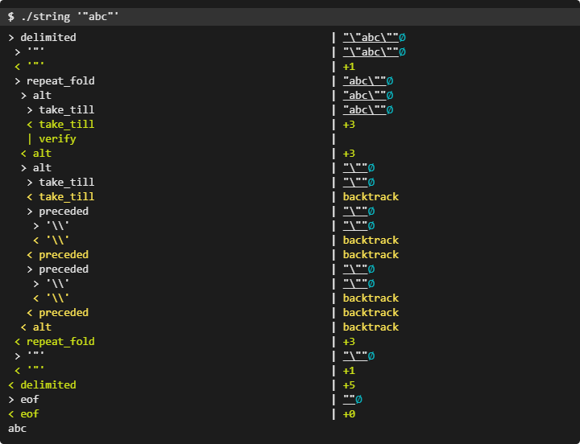

Шаг 3.4: Регулярные выражения и пользовательские парсеры
================================================

__Estimated time__: 1 day


## Regular expressions

Для работы с [регулярными выражениями][1] в экосистеме [Rust] существует crate [`regex`], который в большинстве случаев является своего рода выбором по умолчанию.

> Библиотека Rust для анализа, компиляции и выполнения регулярных выражений. Её синтаксис похож на синтаксис регулярных выражений в стиле Perl, но ей не хватает некоторых функций, таких как поиск по строкам и обратные ссылки. Взамен все поиски выполняются за линейное время относительно размера регулярного выражения и текста поиска. Большая часть синтаксиса и реализации вдохновлена ​​[RE2].


Если вам необходимы дополнительные функции (например, поиск информации и обратные ссылки), рассмотрите возможность использования:

- [`fancy-regex`] — crate, расширяющий функциональность crate [`regex`].
- [`pcre2`] crate, обеспечивающий безопасную высокоуровневую привязку Rust к библиотеке [PCRE2].
- [`hyperscan`] crate, представляющий собой обертку для библиотеки [Hyperscan].

### Компилировать только один раз.

Важно знать, что в [Rust] __регулярные выражения необходимо компилировать перед использованием__. Компиляция — недешевый процесс. Поэтому следующий код создает проблемы с производительностью:

```rust
fn is_email(email: &str) -> bool {
    let re = Regex::new(".+@.+").unwrap();  // compiles every time the function is called
    re.is_match(email)
}
```

Чтобы избежать ненужных потерь производительности, следует __компилировать регулярное выражение один раз и повторно использовать результат его компиляции__. Этого легко добиться, используя крейт [`once_cell`] как в глобальной, так и в локальной областях видимости:

```rust
static REGEX_EMAIL: Regex = once_cell::sync::Lazy::new(|| {
    Regex::new(".+@.+").unwrap()
}); // compiles once on the first use

fn is_email(email: &str) -> bool {
    REGEX_EMAIL.is_match(email)
}
```

Возможно, это будет отличаться от того, как [regular expressions][1] используются в других языках программирования, поскольку некоторые из них неявно кэшируют результаты компиляции и/или вообще не предоставляют API компиляции (например, [PHP]). Но если вы знакомы с такими языками, как [Go] или [Java], то эта концепция должна быть вам знакома.


## Пользовательские парсеры

Если регулярные выражения [недостаточно мощные][2] для вашей задачи парсинга, то вам придётся писать собственный парсер. В экосистеме [Rust] есть [многочисленные][3] библиотеки, которые помогут в этом:

- [Parser combinators][4]:
    - [`nom`] крейт, один из самых производительных среди прочих, особенно хорош для анализа двоичных данных (побайтно-битовых).
    - [`chumsky`] crate, ориентированный на высокое качество, ошибки и эргономику, а не на производительность.
    - [`combine`] crate, вдохновленный библиотекой [Parsec] в [Haskell].
    - [`pom`] crate, предоставляющий комбинаторы парсеров [PEG][5], созданные с использованием перегрузки операторов без макросов.
    - [`chomp`] crate, быстрая библиотека [комбинатора парсеров][4] в стиле [monadic][13].
- [Parser generators][12]:
    - [`peg`] crate, простой, но гибкий [генератор парсеров][12], который позволяет легко писать надежные парсеры, основанные на формализме [Parsing Expression Grammar][5].
    - [`pest`] crate, с упором на доступность, корректность и производительность, используя [PEG (грамматика синтаксического анализа выражений)][5] в качестве входных данных и выводя для него код парсера.
    - [`lalrpop`] crate, генерирующий код [LR(1) парсер][6] из пользовательских файлов грамматики.
    - [`parsel`] crate — библиотека для генерации парсеров непосредственно из типов узлов синтаксического дерева.

Для лучшего понимания проблемы синтаксического анализа и подходов, а также для ознакомления с примерами, прочтите следующее:
- [Laurence Tratt: Which Parsing Approach?][9]
- [Richard L. Apodaca: A Beginner's Guide to Parsing in Rust][10]
- [Eshan Singh: Practical Parsing in Rust with nom][14]
- [Nazmul Idris: Guide to parsing with nom][18]
- [Brian Kung: Building a CEDICT parser in Rust with Nom][11]
- [The Nom Guide (Nominomicon)][19]
- [Aleksey Kladov: Resilient LL Parsing Tutorial][15]
- [Aleksey Kladov: Simple but Powerful Pratt Parsing][16]
- [Aleksey Kladov: From Pratt to Dijkstra][17]


## Task

Дана следующая [синтаксическая грамматика fmt в Rust][7]:
> ```
> format_string := text [ maybe_format text ] *
> maybe_format := '{' '{' | '}' '}' | format
> format := '{' [ argument ] [ ':' format_spec ] [ ws ] * '}'
> argument := integer | identifier
>
> format_spec := [[fill]align][sign]['#']['0'][width]['.' precision]type
> fill := character
> align := '<' | '^' | '>'
> sign := '+' | '-'
> width := count
> precision := count | '*'
> type := '' | '?' | 'x?' | 'X?' | identifier
> count := parameter | integer
> parameter := argument '$'
> ```
> В приведенной выше грамматике,
> - `text` не должен содержать символов `'{'` или `'}'`.
> - `ws` — это любой символ, для которого метод `char::is_whitespace` возвращает `true` ([`char::is_whitespace`](https://doc.rust-lang.org/std/primitive.char.html#method.is_whitespace) не имеет семантического значения и является полностью необязательным.
> - `integer` — это десятичное целое число, которое может содержать ведущие нули и должно помещаться в `usize`.
> - `identifier` — это `IDENTIFIER_OR_KEYWORD` (а не `IDENTIFIER`), как определено в [справочнике по языку Rust](https://doc.rust-lang.org/reference/identifiers.html).

Реализуйте парсер для извлечения значений `sign`, `width` и `precision` из заданного входного параметра (предполагается, что это `format_spec`).

Предлагаются две реализации: на основе [`regex`] и путем создания собственного парсера.

Подтвердите корректность своей реализации с помощью тестов.

## Questions

После выполнения всех вышеперечисленных действий вы должны уметь ответить (и понять, почему) на следующие вопросы:
- [Как библиотека `regex` достигает линейной временной сложности? Какой ценой?][030401]

- [Как избежать перекомпиляции регулярных выражений в Rust? Почему это важно?][030402]

- [Какие библиотеки наиболее распространены для написания пользовательских парсеров на Rust? Какие преимущества у каждой из них?][030403]

- [Какие преимущества дают библиотеки при написании собственного парсера? Являются ли они обязательными? Когда имеет смысл избегать использования библиотек для реализации парсера?][030404]

- [Базовые конструкции regex][030405]

- [Парзер winnow, делающиё разбор лёгким (руководство)][030406]

<hr>

<a name="q-030401"><h3>Как библиотека [regex] достигает линейной временной сложности? Какой ценой?</h3></a>

Крейт regex в Rust гарантирует линейную временную сложность \(O(m * n)\), где \(m\) — длина регулярного выражения, а \(n\) — длина текста. Это достигается за счет использования детерминированных и недетерминированных конечных автоматов (DFA/NFA). 

|натменование|расшифровка|пояснение|
|------------|-----------|---------|
|DFA - deterministic finite automaton|детерминированный конечный автомат|Это конечный автомат, который принимает или отклоняет заданную строку символов путём прохождения через последовательность состояний, определённых строкой. Во время работы такой автомат имеет единственную последовательность состояний.|
|NFA - nondeterministic finite automaton|недетерминированный конечный автомат|Это обобщение детерминированного автомата, в котором переход в данной конфигурации может быть определён не единственным образом|

#### Как достигается линейная сложность?

1. _Алгоритм Томпсона (NFA)_: В отличие от библиотек с бэктрекингом (как в Python, PCRE или Java), Rust не "пробует" один путь, а затем откатывается назад при неудаче. Вместо этого он отслеживает все возможные состояния автомата параллельно за один проход по тексту.
2. _Ленивые DFA_: Библиотека строит детерминированный автомат прямо во время поиска. Если состояние уже было вычислено, оно берется из кэша. Это дает скорость уровня «сырого» скомпилированного кода на C.
3. _Отсутствие экспоненциального взрыва_: Поскольку пути не перебираются по очереди, Rust неуязвим к атакам типа ReDoS (Regular Expression Denial of Service). Ваша программа не зависнет на «катастрофических» выражениях вроде _\(a+\)+$_.

#### Какой ценой это достигается? (Ограничения)

Отказ от бэктрекинга делает невозможным поддержку некоторых популярных, но "медленных" функций:

1. _Нет обратных ссылок (Backreferences)_: Вы не можете написать _(abc|def)\1_, чтобы найти повторение той же подстроки. Эта функция делает задачу NP-полной и не может быть реализована за линейное время.
2. _Нет Look-around (Look-ahead/Look-behind)_: В стандартном крейте regex отсутствуют проверки вида «найти X, только если после него нет Y». Это плата за гарантию того, что поиск никогда не станет "тормозом" системы.
3. _Время компиляции и память_: Построение автоматов (особенно DFA) требует времени при запуске программы и потребляет память под кэш состояний.
4. _Размер бинарного файла_: Библиотека regex довольно тяжелая, так как включает в себя таблицы Unicode и сложную логику оптимизации.

#### Резюме:

Библиотека regex в Rust выбирает предсказуемость и безопасность. Она идеально подходит для обработки данных из сети, где нельзя доверять сложности входящего выражения. Если же вам критически нужны __Backreferences__ или __Look-around__, вам придется использовать альтернативные крейты, такие как __fancy-regex__, осознавая риски потери производительности.

<hr>

<a name="q-030402"><h3>Как избежать перекомпиляции регулярных выражений в Rust? Почему это важно?</h3></a>

В Rust перекомпиляция регулярных выражений — это дорогостоящая операция, которая включает парсинг строки, построение NFA/DFA и оптимизацию автоматов. Если делать это внутри цикла или при каждом вызове функции, производительность приложения упадет в десятки раз.

Вот как этого избежать:

#### 1. Использование OnceLock (Рекомендуемый способ)

С версии Rust 1.70 стандартным идиоматичным способом является использование _std::sync::OnceLock_. Это позволяет скомпилировать регулярное выражение один раз при первом обращении и безопасно использовать его во всех потоках.

```rust
use regex::Regex;
use std::sync::OnceLock;

fn is_valid_email(email: &str) -> bool {
    // Статическая переменная инициализируется лениво
    static RE: OnceLock<Regex> = OnceLock::new();
    
    let re = RE.get_or_init(|| {
        Regex::new(r"^[a-z0-9._%+-]+@[a-z0-9.-]+\.[a-z]{2,}$").unwrap()
    });
    
    re.is_match(email)
}
```

#### 2. Использование макроса regex! (Крейт lazy-regex)

Если вы хотите еще больше удобства, библиотека __lazy-regex__ предоставляет макрос, который под капотом делает то же самое, что и __OnceLock__, но выглядит лаконичнее.

```rust
use lazy_regex::regex_is_match;

fn check(input: &str) {
    // Скомпилируется один раз при первом проходе
    if regex_is_match!(r"^\d+$", input) {
        println!("Это число!");
    }
}
```

#### 3. Передача по ссылке

Если логика позволяет, скомпилируйте Regex один раз при старте программы (например, в структуре приложения) и передавайте ссылку на него в функции.

```rust
struct Validator {
    re: Regex,
}

impl Validator {
    fn validate(&self, text: &str) -> bool {
        self.re.is_match(text)
    }
}
```

#### Почему это критически важно?

1. _Скорость (CPU)_: Компиляция регулярного выражения требует значительных вычислительных ресурсов. Обычный поиск по уже скомпилированному дереву в сотни раз быстрее его создания.
2. _Аллокации (Memory)_: При каждой компиляции выделяется память в куче для хранения состояний автомата. Постоянная перекомпиляция создает огромную нагрузку на аллокатор памяти.
3. _Безопасность потоков_: Объект Regex в Rust является Send + Sync. Это значит, что один раз скомпилированный экземпляр можно безопасно использовать из множества потоков одновременно без мьютексов.
4. _Гарантии линейного времени_: Поскольку Rust использует DFA/NFA, основная сложность ложится именно на этап подготовки. Избегая перекомпиляции, вы оставляете только эффективную стадию поиска.

__Совет__: Если ваше регулярное выражение известно заранее, всегда делайте его _static_. Это «бесплатная» оптимизация, которая сделает ваш код профессиональным.

<hr>

<a name="q-030403"><h3>Какие библиотеки наиболее распространены для написания пользовательских парсеров на Rust? Какие преимущества у каждой из них?</h3></a>

1. #### Nom (Парсер-комбинаторы)

Это самая популярная библиотека, основанная на принципе «комбинаторов» — маленьких функций-парсеров, которые собираются в большие.

- __Преимущества__:
    - _Производительность_: Построена на __Zero-copy__ — работает со срезами данных (__&[u8]__ или __&str__) без лишних аллокаций.
    - _Гибкость_: Вы пишете обычный код на Rust. Легко отлаживать и расширять.
    - _Поддержка бинарных данных_: Идеальна для сетевых протоколов и парсинга форматов файлов (например, заголовков изображений).
- __Когда выбирать__: Для бинарных форматов или когда нужен полный контроль над логикой парсинга.

2. #### Pest (PEG-парсеры)

Использует грамматику _PEG_ (Parsing Expression Grammar), которая описывается в отдельном файле .pest.

- __Преимущества__:
    - _Читаемость_: Грамматика отделена от логики Rust. Она выглядит почти как регулярные выражения, но гораздо мощнее.
    - _Удобство_: Автоматически генерирует дерево разбора (PST).
    - _Дружелюбность к ошибкам_: Встроены отличные механизмы для вывода понятных сообщений об ошибках с указанием строк и столбцов.
- __Когда выбирать__: Для создания новых языков программирования, конфигов или сложных текстовых форматов, где важна строгая структура.

3. #### Winnow (Наследник Nom)

Это форк _nom_, который сфокусирован на эргономике и улучшении сообщений об ошибках, сохраняя при этом ту же скорость.

- __Преимущества__:
    - _API_: Более современный и интуитивно понятный интерфейс по сравнению с классическим nom.
    - _Лучшие ошибки_: Помогает быстрее понять, почему парсинг не удался.
    - _Постепенный переход_: Очень легко мигрировать с nom.
- __Когда выбирать__: Если вам нравится подход комбинаторов, но вы хотите более приятный и современный API.

#### Сводная таблица выбора

|Характеристика|Nom|Pest|Winnow|
|--------------|---|----|------|
|Стиль|Код (Комбинаторы)|Грамматика (PEG)|Код (Улучшенные комбинаторы)|
|Бинарные данные|Отлично|Средне|Отлично|
|Текстовые форматы|Хорошо|Идеально|Хорошо|
|Сложность обучения|Высокая|Низкая|Средняя|

#### Почетное упоминание: LALRPOP

Если вы привыкли к классическим генераторам парсеров (как Yacc или Bison), этот крейт предоставляет мощную LR грамматику. Он сложнее в настройке, но незаменим для очень сложных языковых конструкций.


<hr>

<a name="q-030404"><h3>Какие преимущества дают библиотеки при написании собственного парсера? Являются ли они обязательными? Когда имеет смысл избегать использования библиотек для реализации парсера?</h3></a>

Использование библиотек для парсинга в Rust — это вопрос выбора между скоростью разработки и минимализмом бинарного файла.

#### Преимущества библиотек (Nom, Pest, Winnow)

1. _Декларативность и читаемость_: Вместо сотен вложенных if и match, вы описываете структуру данных. Например, в Pest грамматика выглядит как схема, понятная даже не программисту.
2. _Обработка ошибок «из коробки»_: Написание качественных сообщений об ошибках (с указанием строки, колонки и контекста) — это 50% работы над парсером. Библиотеки делают это автоматически.
3. _Безопасность и оптимизация_: Библиотеки вроде Nom или Winnow спроектированы для работы в режиме Zero-copy. Они максимально эффективно используют срезы памяти (_&str/&[u8]_), предотвращая лишние аллокации.
4. _Устойчивость к граничным случаям_: Библиотеки уже прошли проверку на переполнения, некорректный Unicode и бесконечные циклы, что критично для безопасности.

#### Являются ли они обязательными?

Нет. Парсер на чистом Rust — это просто функция, принимающая _&str_ или _&[u8]_ и возвращающая _Result_. Стандартная библиотека предоставляет мощные инструменты:

- _Методы str_: split, find, starts_with, parse::<T>().
- _Итераторы_: .peekable(), .take_while().

#### Когда имеет смысл ИЗБЕГАТЬ библиотек?

1. _Экстремально простая задача_: Если вам нужно распарсить строку вида ключ: значение, подключение nom добавит больше сложности и времени компиляции, чем принесет пользы.
2. _Минимизация зависимостей_: В системном коде или встроенных системах (Embedded) каждый лишний крейт увеличивает время сборки и размер бинарника.
3. _Специфические требования к производительности_: Иногда (очень редко) обобщенные алгоритмы библиотек могут быть на 5-10% медленнее, чем написанный вручную и максимально оптимизированный под конкретный формат конечный автомат (FSM).
4. _Обучение_: Написание парсера вручную — лучший способ глубоко понять, как работают итераторы и заимствования (ownership) в Rust.

#### Резюме: Правило выбора

- _Нужно распарсить сложный язык или протокол?_ Используйте __Pest__ или __Winnow__.
- _Нужно разобрать бинарный формат (видео, пакеты)?_ Используйте __Nom__.
- _Нужно вытащить пару значений из простого конфига?_ Используйте стандартные методы __str__.

<hr>

<a name="q-030405"><h3>Базовые конструкции regex</h3></a>

1. #### Литералы
```rust
let re = Regex::new(r"abc"); // Точное совпадение "abc"
```

2. #### Метасимволы (специальные символы)
```regex
.       // Любой символ, кроме новой строки (по умолчанию)
\d      // Цифра [0-9]
\D      // Не цифра [^0-9]
\w      // Словесный символ [a-zA-Z0-9_] (Unicode-aware)
\W      // Не словесный символ
\s      // Пробельный символ [ \t\n\r\f]
\S      // Не пробельный символ
```

3. #### Классы символов
```regex
[abc]           // a, b или c
[^abc]          // Любой символ, кроме a, b, c
[a-z]           // Любая строчная буква
[A-Z]           // Любая заглавная буква
[а-яё]          // Русские буквы (строчные)
[А-ЯЁ]          // Русские буквы (заглавные)
[a-zA-Z0-9]     // Буквы и цифры
[[:alpha:]]     // Буква (Unicode)
[[:digit:]]     // Цифра
[[:alnum:]]     // Буква или цифра
[[:space:]]     // Пробельный символ
[[:punct:]]     // Знак пунктуации
```

4. #### Квантификаторы (повторители)
```regex
?           // 0 или 1 раз
*           // 0 или более раз
+           // 1 или более раз
{n}         // Ровно n раз
{n,}        // n или более раз
{n,m}       // От n до m раз

// Ленивые (нежадные) версии:
*?          // 0 или более раз (ленивый)
+?          // 1 или более раз (ленивый)
??          // 0 или 1 раз (ленивый)
```

5. #### Группировка
```regex
(expr)          // Захватывающая группа
(?:expr)        // Незахватывающая группа
(?P<name>expr)  // Именованная группа
```

6. #### Альтернация (ИЛИ)
```regex
a|b         // a или b
(abc|def)   // abc или def
```

7. #### Привязки
```regex
^       // Начало строки (или начало текста в многострочном режиме)
$       // Конец строки (или конец текста в многострочном режиме)
\A      // Начало текста
\z      // Конец текста
\b      // Граница слова
\B      // Не граница слова
```

8. #### Модификаторы (флаги)

Устанавливать в начале __regex__.

```regex
(?i)    // Регистронезависимый поиск
(?m)    // Многострочный режим (^ и $ для строк)
(?s)    // Однострочный режим (. включает \n)
(?x)    // Игнорировать пробелы и комментарии
(?U)    // Ленивый (нежадный) режим по умолчанию

// Комбинация:
(?im)   // Регистронезависимый + многострочный
```

9. #### Unicode свойства
```regex
\p{L}       // Любая буква (Letter)
\p{Ll}      // Строчная буква
\p{Lu}      // Заглавная буква
\p{N}       // Число (Number)
\p{Sc}      // Символ валюты
\p{Cyrillic} // Кириллические символы
\p{Han}     // Китайские иероглифы
\p{Emoji}   // Эмодзи
```

10. #### Lookaround (опережающие и ретроспективные проверки)
```regex
// Положительный lookahead
(?=abc)     // За которой следует "abc"

// Отрицательный lookahead
(?!abc)     // За которой НЕ следует "abc"

// Положительный lookbehind
(?<=abc)    // Перед которой есть "abc"

// Отрицательный lookbehind
(?<!abc)    // Перед которой НЕТ "abc"
```

11. #### Комментарии в regex (требует флага (?x))
```regex
let re = Regex::new(r"(?x)
    ^           # Начало строки
    \d{3}       # Код города
    -           # Разделитель
    \d{2}       # Первые две цифры
    -           # Разделитель  
    \d{4}       # Последние четыре цифры
    $           # Конец строки
").unwrap();
```

12. #### Символы, требующие экранирования
```regex
. ^ $ * + ? ( ) [ ] { } | \ / #
```

13. #### Полезные экранированные последовательности
```regex
\t      // Табуляция
\n      // Новая строка  
\r      // Возврат каретки
\0      // Null символ
\x41    // ASCII символ (здесь: 'A')
\u{0410} // Unicode символ (здесь: 'А')
```
14. #### Базовые примеры

```regex
// Электронная почта
r"^[a-zA-Z0-9._%+-]+@[a-zA-Z0-9.-]+\.[a-zA-Z]{2,}$"

// Телефон (упрощенно)
r"\+?\d[\d\s\-\(\)]{7,}\d"

// IP адрес
r"\b(?:\d{1,3}\.){3}\d{1,3}\b"

// Дата в формате DD.MM.YYYY
r"\b(0[1-9]|[12][0-9]|3[01])\.(0[1-9]|1[0-2])\.\d{4}\b"
```

15. #### Примеры с группами

```regex
// Извлечение частей даты
let re = Regex::new(r"(\d{4})-(\d{2})-(\d{2})").unwrap();

// Именованные группы для URL
let re = Regex::new(
    r"(?x)
    ^
    (?P<scheme>https?)://
    (?P<host>[^/:]+)
    (?::(?P<port>\d+))?
    (?:/(?P<path>.*))?
    $
    "
).unwrap();
```

16. #### Примеры с Unicode

```regex
// Слова на любом языке (буквы + дефисы)
let re = Regex::new(r"\b\p{L}+(?:-\p{L}+)*\b").unwrap();

// Смесь русского и английского текста
let re = Regex::new(r"[\p{Cyrillic}\p{Latin}]+").unwrap();

// Все эмодзи
let re = Regex::new(r"\p{Emoji}+").unwrap();
```

17. #### Lookaround примеры

```regex
// Числа, за которыми не следует "px"
let re = Regex::new(r"\d+(?!px)").unwrap();

// Слово "error", перед которым не стоит "no"
let re = Regex::new(r"(?<!no )error").unwrap();

// Пароль: минимум 8 символов, есть цифра и заглавная буква
let re = Regex::new(r"^(?=.*\d)(?=.*[A-Z]).{8,}$").unwrap();
```

18. #### Экранирование
```regex
// В Rust сырых строках
r"\d+\.\d+"          // Ищет: цифры.цифры
r"\[.*\]"            // Ищет: [любой текст]

// Если не используете сырые строки
"\\d+\\.\\d+"        // То же самое, но с двойным экранированием
"\\[.*\\]"           // Экранирование обратного слэша
```

19. #### Комментарии в regex (требует флага (?x))

```regex
let re = Regex::new(r"(?x)
    ^           # Начало строки
    \d{3}       # Код города
    -           # Разделитель
    \d{2}       # Первые две цифры
    -           # Разделитель  
    \d{4}       # Последние четыре цифры
    $           # Конец строки
").unwrap();
```

20. #### Поддержка Unicode по умолчанию

```regex
// \w включает Unicode символы
let re = Regex::new(r"\w+").unwrap();
assert!(re.is_match("привет"));    // true
assert!(re.is_match("hello"));     // true
assert!(re.is_match("123"));       // true
```

21. #### Границы слов Unicode-aware
```regex
let re = Regex::new(r"\b\w+\b").unwrap();
let text = "Hello, мир! 123 test.";
for word in re.find_iter(text) {
    println!("{}", word.as_str()); // Hello, мир, 123, test
}
```

#### Советы по производительности

1.  Компилируйте один раз: _Regex::new()_ дорогая операция
2.  Используйте атомарные группы: _(?>...)_ для предотвращения _backtracking_
3.  Избегайте захвата групп: используйте _(?:...)_ если не нужны группы
4.  Будьте конкретны: _\d{4}_ лучше чем _\d\d\d\d_

<hr>

<a name="q-030406"><h3>Парзер winnow, делающиё разбор лёгким (руководство)</h3></a>

[Tutorial](https://docs.rs/winnow/latest/winnow/_tutorial/chapter_0/index.html)

### Глава 1: Winnow Way

Прежде всего, нам нужно понять, как winnow обрабатывает синтаксический анализ. Как обсуждалось во введении, winnow позволяет нам создавать более сложные парсеры из более простых (используя «комбинаторы»).

Давайте обсудим, что на самом деле делает «парсер». Парсер принимает входные данные и обрабатывает их до тех пор, пока не вернет результат, где:

- _Ok_ означает, что парсер успешно нашел то, что искал; или
- _Err_ означает, что парсер не смог найти то, что искал.

Парсеры делают больше, чем просто возвращают двоичный код «успех»/«неудача».

В случае успеха парсер вернет обработанные данные. Входные данные будут перемещены в конец обработанного фрагмента, указывая на то, что будет обработано дальше.

Если парсер не сработал, могут быть возвращены различные ошибки. Мы подробнее рассмотрим это в [`главе 7`](#глава-7-сообщение-об-ошибках).

```text
                                 ┌─► Ok(what matched the parser)
            ┌────────┐           │
my input───►│a parser├──►either──┤
            └────────┘           └─► Err(...)
```

Для представления этой модели мира функция winnow использует тип __Result<O>__. Вариант __Ok__ выводит значение __O__, а вариант __Err__ хранит ошибку.

Вы можете импортировать это из:

```rust
use winnow::Result;
```

Для объединения парсеров нам нужен общий способ обращения к ним, и здесь на помощь приходит трейт __Parser<I, O, E>__, а __Parser::parse_next__ является основным способом продвижения парсинга. В [главе 6](#глава-6-интеграция-парсера) мы рассмотрим, как интегрировать их в ваше приложение, в частности, с помощью __Parser::parse__.

Обратите внимание, что __I__ и __O__ параметризованы — хотя большинство примеров в этой книге будут использовать __&str__ (то есть, разбор строки), они не обязательно должны быть строками и не обязательно должны быть одного типа (рассмотрим простой пример, где __I = &str__, а __O = u64__ — это разбор строки в беззнаковое целое число).

- _I_ - Inpur
- _O_ - Output
- _E_ - Error

#### Давайте напишем наш первый парсер!

Простейший парсер, который мы можем написать, — это тот, который успешно ничего не делает.

Чтобы упростить реализацию парсера, трейт реализован для функций вида __Fn(&mut I) -> Result<O>__.

Эта функция парсера должна принимать на вход строку __&str__:

- Поскольку предполагается, что операция должна завершиться успешно, мы знаем, что она вернет вариант "Ok".
- Поскольку она никак не влияет на наши входные данные, они останутся в исходном состоянии.
- Поскольку она ничего не анализирует, она также должна просто вернуть пустую строку.

```rust
use winnow::Result;
use winnow::Parser;

pub fn do_nothing_parser<'s>(input: &mut &'s str) -> Result<&'s str> {
    Ok("")
}

fn main() {
    let mut input = "0x1a2b Hello";

    let output = do_nothing_parser.parse_next(&mut input).unwrap();
    // Same as:
    // let output = do_nothing_parser(&mut input).unwrap();

    assert_eq!(input, "0x1a2b Hello");
    assert_eq!(output, "");
}
```

### Глава 2: Токены и тэги

Самый простой и полезный парсер, который вы можете написать, — это тот, который сопоставляет токены. В нашем случае токены имеют тип char.

#### Токены

Stream предоставляет ряд основных операций для облегчения синтаксического анализа. Например, для обработки
одного токена можно сделать следующее:

```rust
use winnow::stream::Stream;
use winnow::error::ParserError;
use winnow::Result;

fn parse_prefix(input: &mut &str) -> Result<char> {
    let c = input.next_token().ok_or_else(|| {
        ParserError::from_input(input)
    })?;
    if c != '0' {
        return Err(ParserError::from_input(input));
    }
    Ok(c)
}

fn main()  {
    let mut input = "0x1a2b Hello";

    let output = parse_prefix.parse_next(&mut input).unwrap();

    assert_eq!(input, "x1a2b Hello");
    assert_eq!(output, '0');

    assert!(parse_prefix.parse_next(&mut "d").is_err());
}
```

Описание работы кода:

1) __parse_prefix(...)__
    - Берёт первый символ из строки
    - Проверяет, что это символ '0'
    - Возвращает Ok('0') если успешно, или ошибку если нет

2) __.parse_next(&mut input)__

    Метод трейта Parser из winnow. Он:

    - Принимает изменяемую ссылку на входные данные (&mut &str)
    - Вызывает функцию parse_prefix с этими данными
    - Потребляет данные при успешном парсинге
    - Возвращает Result<char>

3) __.unwrap()__

    Стандартный метод Rust для Result:

    - Если результат Ok(value) → возвращает value
    - Если результат Err(error) → паника с ошибкой


Извлечение токена инкапсулировано в any парсер:

```rust
use winnow::Parser;
use winnow::token::any;
use winnow::error::ParserError;
use winnow::Result;

fn parse_prefix(input: &mut &str) -> Result<char> {
    let c = any
        .parse_next(input)?;
    if c != '0' {
        return Err(ParserError::from_input(input));
    }
    Ok(c)
}
```

При использовании более высокого уровня любой парсер открывает __parse_prefix__ для вспомогательных функций трейта __Parser__, таких как __Parser::verify__, который завершает парсинг с ошибкой, если условие не выполняется, как в нашей проверке выше:

```rust
use winnow::Parser;
use winnow::token::any;
use winnow::Result;

fn parse_prefix(input: &mut &str) -> Result<char> {
    let c = any
        .verify(|c| *c == '0')
        .parse_next(input)?;
    Ok(c)
}
```

Сопоставление одного единственного литерала токена достаточно распространено, поэтому для типа char реализован парсер, инкапсулирующий как any, так и Parser::verify:.

```rust
use winnow::Parser;
use winnow::Result;

fn parse_prefix(input: &mut &str) -> Result<char> {
    let c = '0'.parse_next(input)?;
    Ok(c)
}
```
#### Теги

Stream также поддерживает обработку фрагментов токенов:

```rust
use winnow::stream::Stream;
use winnow::error::ParserError;
use winnow::Result;

fn parse_prefix<'s>(input: &mut &'s str) -> Result<&'s str> {
    let expected = "0x";
    if input.len() < expected.len() {
        return Err(ParserError::from_input(input));
    }
    let actual = input.next_slice(expected.len());
    if actual != expected {
        return Err(ParserError::from_input(input));
    }
    Ok(actual)
}

fn main()  {
    let mut input = "0x1a2b Hello";

    let output = parse_prefix.parse_next(&mut input).unwrap();
    assert_eq!(input, "1a2b Hello");
    assert_eq!(output, "0x");

    assert!(parse_prefix.parse_next(&mut "0o123").is_err());
}
```

Сопоставление позиции входного значения со строковым литералом инкапсулировано в парсере литералов:

```rust
use winnow::token::literal;

fn parse_prefix<'s>(input: &mut &'s str) -> Result<&'s str> {
    let expected = "0x";
    let actual = literal(expected).parse_next(input)?;
    Ok(actual)
}
```

Как и в случае с отдельным токеном, сопоставление строкового литерала достаточно распространено, поэтому парсер реализован для типа __&str__:

```rust
use winnow::Parser;
use winnow::Result;

fn parse_prefix<'s>(input: &mut &'s str) -> Result<&'s str> {
    let actual = "0x".parse_next(input)?;
    Ok(actual)
}
```

Дополнительные парсеры для отдельных токенов и фрагментов токенов см. в разделе token.

### Символьные Классы

Выбор одного символа или литерала довольно ограничен. Иногда вам может потребоваться выбрать один из нескольких символов определенного класса, например, цифры. Для этого мы используем парсер __one_of__:

```rust
use winnow::token::one_of;
use winnow::Result;

fn parse_digits(input: &mut &str) -> Result<char> {
    one_of(('0'..='9', 'a'..='f', 'A'..='F')).parse_next(input)
}

fn main() {
    let mut input = "1a2b Hello";

    let output = parse_digits.parse_next(&mut input).unwrap();
    assert_eq!(input, "a2b Hello");
    assert_eq!(output, '1');

    assert!(parse_digits.parse_next(&mut "Z").is_err());
}
```

Примечание: функция [one_of](https://docs.rs/winnow/latest/winnow/token/fn.one_of.html) может показаться простой, возвращающей   значение, реализующее интерфейс __Parser__. Давайте рассмотрим её подробнее, как она используется выше (с разрешением всех обобщенных параметров):

```rust
pub fn one_of<'i>(
        list: &'static [char]
    ) -> impl Parser<&'i str, char, ContextError> {
        // ...
}
```

Если вы никогда не программировали на языке, где функции являются значениями, сигнатура типа функции one_of может вас удивить. Функция __one_of__ возвращает функцию. Возвращаемая ею функция — это парсер, принимающий __&str__ и возвращающий __Result__. Это распространенный шаблон в __winnow__ для настраиваемых или сохраняющих состояние парсеров.

Некоторые классы символов достаточно распространены, поэтому для них предусмотрен именованный парсер, например:

- [line_ending](https://docs.rs/winnow/latest/winnow/ascii/fn.line_ending.html): Распознает конец строки (как \n, так и \r\n)
- [newline](https://docs.rs/winnow/latest/winnow/ascii/fn.newline.html): Соответствует символу новой строки \n
- [tab](https://docs.rs/winnow/latest/winnow/ascii/fn.tab.html): Соответствует символу табуляции \t

Затем вы можете захватывать последовательности этих символов с помощью таких парсеров, как __take_while__.

```rust
use winnow::token::take_while;

fn parse_digits<'s>(input: &mut &'s str) -> Result<&'s str> {
    take_while(1.., ('0'..='9', 'a'..='f', 'A'..='F')).parse_next(input)
}

fn main() {
    let mut input = "1a2b Hello";

    let output = parse_digits.parse_next(&mut input).unwrap();
    assert_eq!(input, " Hello");
    assert_eq!(output, "1a2b");

    assert!(parse_digits.parse_next(&mut "Z").is_err());
}
```

Мы могли бы еще больше упростить это, используя один из встроенных классов символов, [hex_digit1](https://docs.rs/winnow/latest/winnow/ascii/fn.hex_digit1.html):

```rust
use winnow::ascii::hex_digit1;

fn parse_digits<'s>(input: &mut &'s str) -> Result<&'s str> {
    hex_digit1.parse_next(input)
}

fn main() {
    let mut input = "1a2b Hello";

    let output = parse_digits.parse_next(&mut input).unwrap();
    assert_eq!(input, " Hello");
    assert_eq!(output, "1a2b");

    assert!(parse_digits.parse_next(&mut "Z").is_err());
}
```

См. [ascii](https://docs.rs/winnow/latest/winnow/ascii/index.html) для получения информации о других текстовых парсерах.

### Глава 3. Последовательность и альтернативы

В предыдущей главе мы рассмотрели, как создавать парсеры, используя готовые шаблоны.

В этой главе мы рассмотрим две другие широко используемые функции: секвенирование и альтернативы.

#### Последовательность действий

Теперь, когда мы можем создавать более интересные парсеры, мы можем объединять их в последовательность, например:

```rust
use winnow::token::take_while;
use winnow::Result;

fn parse_prefix<'s>(input: &mut &'s str) -> Result<&'s str> {
    "0x".parse_next(input)
}

fn parse_digits<'s>(input: &mut &'s str) -> Result<&'s str> {
    take_while(1.., (
        ('0'..='9'),
        ('A'..='F'),
        ('a'..='f'),
    )).parse_next(input)
}

fn main()  {
    let mut input = "0x1a2b Hello";

    let prefix = parse_prefix.parse_next(&mut input).unwrap();
    let digits = parse_digits.parse_next(&mut input).unwrap();

    assert_eq!(prefix, "0x");
    assert_eq!(digits, "1a2b");
    assert_eq!(input, " Hello");
}
```

Чтобы объединить их в последовательность, вы можете просто объединить их в кортеж:

```rust
//...

fn main()  {
    let mut input = "0x1a2b Hello";

    let (prefix, digits) = (
        parse_prefix,
        parse_digits
    ).parse_next(&mut input).unwrap();

    assert_eq!(prefix, "0x");
    assert_eq!(digits, "1a2b");
    assert_eq!(input, " Hello");
}
```

Зачастую вам будет всё равно на буквальное значение, и вы сможете использовать один из предложенных комбинаторов, подобно [preceded](https://docs.rs/winnow/latest/winnow/combinator/fn.preceded.html):

```rust
use winnow::combinator::preceded;

//...

fn main() {
    let mut input = "0x1a2b Hello";

    let digits = preceded(
        parse_prefix,
        parse_digits
    ).parse_next(&mut input).unwrap();

    assert_eq!(digits, "1a2b");
    assert_eq!(input, " Hello");
}
```

См. раздел [combinator](https://docs.rs/winnow/latest/winnow/combinator/index.html) для получения информации о других парсерах для анализа последовательностей.

#### Альтернативы

Иногда нам может потребоваться выбрать один из двух парсеров, и нас устроит любой из них.

Чтобы повторить результат парсинга, мы можем сохранить его в контрольной точке [Stream::checkpoint](https://docs.rs/winnow/latest/winnow/stream/trait.Stream.html#tymethod.checkpoint), а затем восстановить парсер в этой позиции с помощью [Stream::reset](https://docs.rs/winnow/latest/winnow/stream/trait.Stream.html#tymethod.reset):

```rust
use winnow::stream::Stream;

fn parse_digits<'s>(input: &mut &'s str) -> Result<(&'s str, &'s str)> {
    let start = input.checkpoint(); // сохранить контрольную точку
    if let Ok(output) = ("0b", parse_bin_digits).parse_next(input) {
        return Ok(output);
    }

    input.reset(&start);    // восстановить контрольную точку
    if let Ok(output) = ("0o", parse_oct_digits).parse_next(input) {
        return Ok(output);
    }

    input.reset(&start);
    if let Ok(output) = ("0d", parse_dec_digits).parse_next(input) {
        return Ok(output);
    }

    input.reset(&start);
    ("0x", parse_hex_digits).parse_next(input)
}

// ...

fn main() {
    let mut input = "0x1a2b Hello";

    let (prefix, digits) = parse_digits.parse_next(&mut input).unwrap();

    assert_eq!(input, " Hello");
    assert_eq!(prefix, "0x");
    assert_eq!(digits, "1a2b");

    assert!(parse_digits(&mut "ghiWorld").is_err());
}
```

Предупреждение: приведенный выше пример носит иллюстративный характер, и использование __Result::Ok__ или __Result::Err__ может привести к некорректному поведению. Это будет разъяснено позже при рассмотрении обработки ошибок.

[opt](https://docs.rs/winnow/latest/winnow/combinator/fn.opt.html) — это парсер, который воплощает в себе этот принцип «повторной попытки при неудаче»:

```rust
use winnow::combinator::opt;

fn parse_digits<'s>(input: &mut &'s str) -> Result<(&'s str, &'s str)> {
    if let Some(output) = opt(("0b", parse_bin_digits)).parse_next(input)? {
        Ok(output)
    } else if let Some(output) = opt(("0o", parse_oct_digits)).parse_next(input)? {
        Ok(output)
    } else if let Some(output) = opt(("0d", parse_dec_digits)).parse_next(input)? {
        Ok(output)
    } else {
        ("0x", parse_hex_digits).parse_next(input)
    }
}
```

[alt](https://docs.rs/winnow/latest/winnow/combinator/fn.alt.html) воплощает в себе эту цепочку условий `if/else-if`, где последним условием является оператор `else`:

```rust
use winnow::combinator::alt;

fn parse_digits<'s>(input: &mut &'s str) -> Result<(&'s str, &'s str)> {
    alt((
        ("0b", parse_bin_digits),
        ("0o", parse_oct_digits),
        ("0d", parse_dec_digits),
        ("0x", parse_hex_digits),
    )).parse_next(input)
}
```

Примечание: [empty](https://docs.rs/winnow/latest/winnow/combinator/fn.empty.html) и [fail](https://docs.rs/winnow/latest/winnow/combinator/fn.fail.html) — это парсеры, которые могут быть полезны в случае использования оператора «else».

Иногда использование громоздкой лестницы операторов if/else-if может замедлять работу, и в этом случае предпочтительнее использовать оператор match для ветвей парсера, имеющих уникальные префиксы. В таком случае можно использовать макрос [dispatch](https://docs.rs/winnow/latest/winnow/combinator/macro.dispatch.html):

```rust
use winnow::combinator::dispatch;
use winnow::token::take;
use winnow::combinator::fail;

fn parse_digits<'s>(input: &mut &'s str) -> Result<&'s str> {
    dispatch!(take(2usize);
        "0b" => parse_bin_digits,
        "0o" => parse_oct_digits,
        "0d" => parse_dec_digits,
        "0x" => parse_hex_digits,
        _ => fail,
    ).parse_next(input)
}
```

Примечание: функция [peek](https://docs.rs/winnow/latest/winnow/combinator/fn.peek.html) может быть полезна при [dispatch](https://docs.rs/winnow/latest/winnow/combinator/macro.dispatch.html) на основе подсказок из парсера каждого конкретного случая.

См. раздел [combinator](https://docs.rs/winnow/latest/winnow/combinator/index.html) для получения информации о других альтернативных парсерах.

### Глава 4: Парсеры с пользовательскими типами возвращаемых значений

До сих пор мы рассматривали в основном функции, которые принимают __&str__ и возвращают __Result<&str>__. Разделение строк на более мелкие строки и символы, безусловно, полезно, но это не единственное, на что способен winnow!

Полезной операцией при синтаксическом анализе является преобразование между типами; например, преобразование из __&str__ в другой примитивный тип, такой как __usize__.

Для того чтобы наш парсер возвращал другой тип, нам нужно всего лишь изменить параметр типа объекта Result на желаемый возвращаемый тип. Например, чтобы вернуть __usize__, верните __Result<usize>__.

Один из способов преобразования типов, встроенных в механизм фильтрации, — это использование комбинатора [Parser::parse_to](https://docs.rs/winnow/latest/winnow/trait.Parser.html#method.parse_to) для преобразования успешного синтаксического анализа в определенный тип с помощью функции [FromStr](https://doc.rust-lang.org/nightly/core/str/traits/trait.FromStr.html).

Следующий код преобразует строку, содержащую число, в переменную размера usize:

```rust
use winnow::Result;
use winnow::ascii::digit1;

fn parse_digits(input: &mut &str) -> Result<usize> {
    digit1
        .parse_to::<usize>()    // добавил ::<usize> для вного преобразования
        .parse_next(input)
}

fn main() {
    let mut input = "1024 Hello";

    let output = parse_digits.parse_next(&mut input).unwrap();
    assert_eq!(input, " Hello");
    assert_eq!(output, 1024);

    assert!(parse_digits(&mut "Z").is_err());
}
```

Parser::parse_to — это всего лишь удобная форма [Parser::try_map](https://docs.rs/winnow/latest/winnow/trait.Parser.html#method.try_map), которую мы можем использовать для обработки
всех систем счисления чисел:

```rust
use winnow::Result;
use winnow::combinator::dispatch;
use winnow::token::take;
use winnow::combinator::fail;

fn parse_digits(input: &mut &str) -> Result<usize> {
    dispatch!(take(2usize);
        "0b" => parse_bin_digits.try_map(|s| usize::from_str_radix(s, 2)),
        "0o" => parse_oct_digits.try_map(|s| usize::from_str_radix(s, 8)),
        "0d" => parse_dec_digits.try_map(|s| usize::from_str_radix(s, 10)),
        "0x" => parse_hex_digits.try_map(|s| usize::from_str_radix(s, 16)),
        _ => fail,
    ).parse_next(input)
}

/* здесь определены:
    parse_bin_digits(...)
    parse_oct_digits(...)
    parse_dec_digits(...)
    parse_hex_digits(...)
*/

fn main() {
    let mut input = "0x1a2b Hello";

    let digits = parse_digits.parse_next(&mut input).unwrap();

    assert_eq!(input, " Hello");
    assert_eq!(digits, 0x1a2b);

    assert!(parse_digits(&mut "ghiWorld").is_err());
}
```

См. также раздел [Parser](https://docs.rs/winnow/latest/winnow/trait.Parser.html) для получения информации о других парсерах, изменяющих выходные данные.

### Глава 5: Повторение

В [главе 3](глава-3-последовательность-и-альтернативы) мы рассмотрели, как упорядочить различные парсеры в кортеж, но иногда необходимо запускать один и тот же парсер несколько раз, собирая результаты в контейнер, например, Vec.

Давайте получим результат выполнения функции parse_digits:

```rust
use winnow::Result;
use winnow::combinator::opt;
use winnow::combinator::terminated;
use winnow::ascii::digit1;

fn parse_digits(input: &mut &str) -> Result<usize> {
    digit1
        .parse_to::<usize>()
        .parse_next(input)
}

fn parse_list(input: &mut &str) -> Result<Vec<usize>> {
    let mut list = Vec::new();
    while let Some(output) = opt(
                                terminated(
                                        parse_digits,
                                       opt(',')
                                    )
                                )
                                .parse_next(input)? {
        list.push(output);
    }
    Ok(list)
}

fn main() {
    let mut input = "1,2,3,4,5 Hello" ;

    let digits = parse_list.parse_next(&mut input).unwrap();

    print!("input: `{}` => ", input) ;
    let digits = parse_list.parse_next(&mut input).unwrap();

    println!("`{}`, digits: {:?}", input, digits) ;

    assert_eq!(input, " Hello");
    assert_eq!(digits, vec![1usize, 2, 3, 4, 5]);

    assert!(parse_digits(&mut "ghiWorld").is_err());

    // -------------------

    let mut input = "0x1a2b,0x3c4d,0x5e6f Hello" ;

    print!("input: `{}` => ", input) ;
    let digits = parse_list.parse_next(&mut input).unwrap();

    println!("`{}`, digits: {:?}", input, digits) ;    
}
```

__Вывод программы:__

```text
input: `1,2,3,4,5 Hello` => ` Hello`, digits: [1, 2, 3, 4, 5]
input: `0x1a2b,0x3c4d,0x5e6f Hello` => `x1a2b,0x3c4d,0x5e6f Hello`, digits: [0]
```

__Разбор сложного вложения парзеров__:

```rust
let v: Result<Option<usize>, winnow::error::ContextError> = 
                opt(
                    terminated(
                                parse_digits,
                                opt(',')
                              )
                )
                .parse_next(input) ;
```

Если parse_digits возвращает ошибку то terminated возвразает ошибку.

_Особенности opt(parser):_

- Если parser успешен → возвращает Ok(Some(result))
- Если parser возвращает ошибку → возвращает Ok(None)
- Никогда не возвращает ошибку (кроме фатальных ошибок вроде OOM)


Мы можем реализовать это декларативно с помощью функции [repeat](https://docs.rs/winnow/latest/winnow/combinator/fn.repeat.html):

```rust
use winnow::combinator::opt;
use winnow::combinator::repeat;
use winnow::combinator::terminated;

fn parse_list(input: &mut &str) -> Result<Vec<usize>> {
    repeat(0..,
        terminated(parse_digits, opt(','))
    ).parse_next(input)
}
```

Вы заметите, что в приведенном выше примере допускается запятая в конце. Однако, если это нежелательно, это легко исправить, используя [separated](https://docs.rs/winnow/latest/winnow/combinator/fn.separated.html) вместо [repeat](https://docs.rs/winnow/latest/winnow/combinator/fn.repeat.html):

```rust
use winnow::combinator::separated;

fn parse_list(input: &mut &str) -> Result<Vec<usize>> {
    separated(0.., parse_digits, ",").parse_next(input)
}

// ...

fn main() {
    let mut input = "0x1a2b,0x3c4d,0x5e6f Hello";

    let digits = parse_list.parse_next(&mut input).unwrap();

    assert_eq!(input, " Hello");
    assert_eq!(digits, vec![0x1a2b, 0x3c4d, 0x5e6f]);

    assert!(parse_digits(&mut "ghiWorld").is_err());
}
```

Если внимательно присмотреться к [separated](https://docs.rs/winnow/latest/winnow/combinator/fn.separated.html) и [repeat](https://docs.rs/winnow/latest/winnow/combinator/fn.repeat.html), то окажется, что они не ограничиваются сбором результата в `Vec`, а реализуют любой трейт `Accumulate`. Например, `Accumulate` также реализован для `HashSet`, `String` и `()`.

Это позволяет нам создавать более сложные парсеры, чем те, что мы использовали в [главе 2](#глава-2-токены-и-тэги), путем накопления результатов в () и обработки полученных входных данных.

Метод take работает следующим образом:

- Создание контрольной точки
- Запуск внутреннего парсера, в нашем случае парсера parse_list, который - будет продвигать входные данные
- Возвращение среза из первой контрольной точки в текущую позицию.

Поскольку результат функции parse_list отбрасывается, мы накапливаем его в (), чтобы не тратить время на создание неиспользуемого вектора.

```rust
fn take_list<'s>(input: &mut &'s str) -> Result<&'s str> {
    parse_list.take().parse_next(input)
}

fn parse_list(input: &mut &str) -> Result<()> {
    separated(0.., parse_digits, ",").parse_next(input)
}


fn main() {
    let mut input = "0x1a2b,0x3c4d,0x5e6f Hello";

    let digits = take_list.parse_next(&mut input).unwrap();

    assert_eq!(input, " Hello");
    assert_eq!(digits, "0x1a2b,0x3c4d,0x5e6f");

    assert!(parse_digits(&mut "ghiWorld").is_err());
}
```

См. раздел [combinator](https://docs.rs/winnow/latest/winnow/combinator/index.html) для получения информации о других парсерах повторений.

### Глава 6: Интеграция парсера

До сих пор мы рассказывали о том, как выполнять инкрементальный анализ, но как объединить все это в нашем приложении?

Парсеры, с которыми мы работали, выглядят следующим образом:

```rust
use winnow::Result;

pub fn parser<'s>(input: &mut &'s str) -> Result<&'s str> {
    // ...
}
```

1. Нам нужно решить, что делать с «остатком» входных данных.
2. Результат может быть несовместим с остальной экосистемой Rust. Обычно приложения Rust хотят получать ошибки, которые имеют тип std::error::Error + Send + Sync + 'static', то есть:
    - Они реализуют трейт std::error::Error
    - Они могут передаваться между потоками
    - На них безопасно ссылаться между потоками
    - Они не заимствуют

Для решения этой задачи winnow предоставляет [Parser::parse](https://docs.rs/winnow/latest/winnow/trait.Parser.html#method.parse):

- Это гарантирует достижение нами конечной [eof](https://docs.rs/winnow/latest/winnow/combinator/fn.eof.html).
- Оборачивает ошибку в [ParseError](https://docs.rs/winnow/latest/winnow/error/struct.ParseError.html).
    - В простых случаях [ParseError](https://docs.rs/winnow/latest/winnow/error/struct.ParseError.html) предоставляет реализацию [std::fmt::Display](https://doc.rust-lang.org/nightly/core/fmt/trait.Display.html) для отображения ошибки.
    - В более сложных случаях [ParseError](https://docs.rs/winnow/latest/winnow/error/struct.ParseError.html) предоставляет исходные [input](https://docs.rs/winnow/latest/winnow/error/struct.ParseError.html#method.input) данные и [offset](https://docs.rs/winnow/latest/winnow/error/struct.ParseError.html#method.offset) места сбоя, так что вы можете сохранить эту информацию в сообщении об ошибке и  [отобразить его так, как вам нужно](https://docs.rs/winnow/latest/winnow/_tutorial/chapter_7/index.html#error-adaptation-and-rendering).
- Преобразует [ModalResult](https://docs.rs/winnow/latest/winnow/error/type.ModalResult.html) в [Result](https://doc.rust-lang.org/nightly/core/result/enum.Result.html) (если используется, подробнее об этом в [главе 7](#глава-7-сообщение-об-ошибках)).

Однако [ParseError](https://docs.rs/winnow/latest/winnow/error/struct.ParseError.html) все равно потребует некоторой адаптации для интеграции с типами ошибок вашего приложения (например, с символом ?).

```rust
use winnow::Parser;

#[derive(Debug, PartialEq, Eq)]
pub struct Hex(usize);      // Структура-обертка для шестнадцатеричного числа

impl std::str::FromStr for Hex {
    type Err = anyhow::Error;   // Используем anyhow::Error как тип ошибки

    fn from_str(input: &str) -> Result<Self, Self::Err> {
        parse_digits    // Предполагается, что это парсер шестнадцатеричных цифр
            .map(Hex)   // Преобразует результат в структуру Hex
            .parse(input)   // Парсит входную строку
            .map_err(|e| anyhow::format_err!("{e}"))    // Конвертирует ошибку winnow в anyhow
    }
}

// ...

fn main() {
    let input = "0x1a2b";
    assert_eq!(input.parse::<Hex>().unwrap(), Hex(0x1a2b));

    let input = "0x1a2b Hello";
    assert!(input.parse::<Hex>().is_err());
    let input = "ghiHello";
    assert!(input.parse::<Hex>().is_err());
}
```

### Глава 7: Сообщение об ошибках

#### Контекст

При использовании [Parser::parse](https://docs.rs/winnow/latest/winnow/trait.Parser.html#method.parse) мы получаем ошибки, указывающие на причину сбоя, но не объясняющие его:

```rust
// ...

fn main() {
    let input = "0xZZ";
    let error = "\
0xZZ
  ^
";
    assert_eq!(input.parse::<Hex>().unwrap_err(), error);
}
```

В [главе 1](#глава-1-winnow-way) мы вскользь упомянули вариант Err объекта `Result`. `Result<O>` — это, по сути, сокращение от `Result<O, E=ContextError>`, где [ContextError](https://docs.rs/winnow/latest/winnow/error/struct.ContextError.html) — это относительно простой способ создания разумных для человека ошибок.

Для уточнения ошибки и добавления пользовательских типов при размотке стека можно использовать [Parser::context](https://docs.rs/winnow/latest/winnow/trait.Parser.html#method.context):

```rust
use winnow::error::StrContext;
use winnow::error::StrContextValue;
use winnow::combinator::alt;
use winnow::Result;
use winnow::token::take_while;

// Парсер для двоичных цифр (0-1)
fn parse_bin_digits<'s>(input: &mut &'s str) -> Result<&'s str> {
    // Распознать самый длинный (m <= len <= n) входной фрагмент, соответствующий набору токенов.
    take_while(
        1.., |c: char| c == '0' || c == '1')
        // Если разбор не удался, добавьте контекст к сообщению об ошибке.
        .context(
            StrContext::Expected(
                    StrContextValue::Description("binary digit (0 or 1)")
                )
            )
        .parse_next(input)
}

// Парсер для восьмеричных цифр (0-7)
fn parse_oct_digits<'s>(input: &mut &'s str) -> Result<&'s str> {
    // Распознать самый длинный (m <= len <= n) входной фрагмент, соответствующий набору токенов.
    take_while(
        1.., 
        |c: char| 
                ('0'..='7')
                    .contains(&c) // Возвращает true, если элемент содержится в заданном диапазоне.
    )
    // Если разбор не удался, добавьте контекст к сообщению об ошибке.
    .context(
        StrContext::Expected(
            StrContextValue::Description("octal digit (0-7)")
        )
    )
    // Извлекает токены из потока и преобразует их в выходные данные.
    .parse_next(input)
}

// Парсер для десятичных цифр (0-9)
fn parse_dec_digits<'s>(input: &mut &'s str) -> Result<&'s str> {
    // Распознать самый длинный (m <= len <= n) входной фрагмент, соответствующий набору токенов.
    take_while(
        1.., 
        |c: char| c.is_ascii_digit()
    )
    // Если разбор не удался, добавьте контекст к сообщению об ошибке.
    .context(
        StrContext::Expected(
            StrContextValue::Description("decimal digit (0-9)")
        )
    )
    // Извлекает токены из потока и преобразует их в выходные данные.
    .parse_next(input)
}

// Парсер для шестнадцатеричных цифр (0-9, A-F, a-f)
fn parse_hex_digits<'s>(input: &mut &'s str) -> Result<&'s str> {
    // Распознать самый длинный (m <= len <= n) входной фрагмент, соответствующий набору токенов.
    take_while(
        1.., 
        |c: char| c.is_ascii_hexdigit() // Проверяет, является ли значение шестнадцатеричной цифрой ASCII:
    )
    // Если разбор не удался, добавьте контекст к сообщению об ошибке.
    .context(
        StrContext::Expected(
            StrContextValue::Description("hexadecimal digit (0-9, A-F, a-f)")
        )
    )
    // Извлекает токены из потока и преобразует их в выходные данные.
    .parse_next(input)
}

/// разбор цифр
fn parse_digits<'s>(input: &mut &'s str) -> Result<(&'s str, &'s str)> {
    // alt((parser1, parser2, parser3, ...)) пытается выполнить парсеры по порядку
    // Возвращает результат первого успешного парсера
    // Если все парсеры неуспешны - возвращает ошибку
    alt((
        ("0b", parse_bin_digits)
            // установка цепочки контекстов
          .context(StrContext::Label("digit"))
          .context(StrContext::Expected(StrContextValue::Description("binary"))),
        ("0o", parse_oct_digits)
            // установка цепочки контекстов
          .context(StrContext::Label("digit"))
          .context(StrContext::Expected(StrContextValue::Description("octal"))),
        ("0d", parse_dec_digits)
            // установка цепочки контекстов
          .context(StrContext::Label("digit"))
          .context(StrContext::Expected(StrContextValue::Description("decimal"))),
        ("0x", parse_hex_digits)
            // установка цепочки контекстов
          .context(StrContext::Label("digit"))
          .context(StrContext::Expected(StrContextValue::Description("hexadecimal"))),
    )).parse_next(input)
}

// ...

fn main() {
    let input = "0xZZ";
    let error = "\
0xZZ
  ^
invalid digit
expected hexadecimal";
    assert_eq!(input.parse::<Hex>().unwrap_err(), error);
}
```

__alt((parser1, parser2, parser3, ...))__:

- пытается выполнить парсеры по порядку
- Возвращает результат первого успешного парсера
- Если все парсеры неуспешны - возвращает ошибку

#### Ошибочные сокращения

У нас по-прежнему остается проблема с тем, что происходит сбой, когда система счисления действительна, но цифры ей не соответствуют:

```rust
fn main() {
    let input = "0b5";
    let error = "\
0b5
^
invalid radix prefix
expected `0b`, `0o`, `0d`, `0x`";
    assert_eq!(input.parse::<Hex>().unwrap_err(), error);
}
```

Winnow предоставляет обертку для ошибок, [ErrMode<ContextError>](https://docs.rs/winnow/latest/winnow/error/enum.ErrMode.html), поэтому различные режимы ошибок могут влиять на синтаксический анализ. ErrMode — это перечисление с вариантами Backtrack и Cut (игнорируйте Incomplete, так как оно актуально только для потоковой обработки). По умолчанию ошибки относятся к режиму Backtrack, что означает, что при сбое будут предприняты попытки выполнения других ветвей синтаксического анализа, например, следующего случая alt. Cut прерывает все остальные ветви, немедленно сообщая об ошибке.

Для повышения удобства использования [ErrMode](https://docs.rs/winnow/latest/winnow/error/enum.ErrMode.html), Winnow предоставляет [ModalResult](https://docs.rs/winnow/latest/winnow/error/type.ModalResult.html):

```rust
pub type ModalResult<O, E = ContextError> = Result<O, ErrMode<E>>;
```

Таким образом, мы можем получить правильный контекст, изменив тип на ModalResult и добавив [cut_err](https://docs.rs/winnow/latest/winnow/combinator/fn.cut_err.html):

__cut_err(parser) применяет parser__

- Если parser возвращает ошибку - она становится "жесткой" (Cut)
- Это предотвращает backtracking и попытки других альтернатив

```rust
use winnow::combinator::cut_err;

fn parse_digits<'s>(input: &mut &'s str) -> ModalResult<(&'s str, &'s str)> {
    alt((
        ("0b", cut_err(parse_bin_digits))
          .context(StrContext::Label("digit"))
          .context(StrContext::Expected(StrContextValue::Description("binary"))),
        ("0o", cut_err(parse_oct_digits))
          .context(StrContext::Label("digit"))
          .context(StrContext::Expected(StrContextValue::Description("octal"))),
        ("0d", cut_err(parse_dec_digits))
          .context(StrContext::Label("digit"))
          .context(StrContext::Expected(StrContextValue::Description("decimal"))),
        ("0x", cut_err(parse_hex_digits))
          .context(StrContext::Label("digit"))
          .context(StrContext::Expected(StrContextValue::Description("hexadecimal"))),
        fail
          .context(StrContext::Label("radix prefix"))
          .context(StrContext::Expected(StrContextValue::StringLiteral("0b")))
          .context(StrContext::Expected(StrContextValue::StringLiteral("0o")))
          .context(StrContext::Expected(StrContextValue::StringLiteral("0d")))
          .context(StrContext::Expected(StrContextValue::StringLiteral("0x"))),
    )).parse_next(input)
}

// ...

fn main() {
    let input = "0b5";
    let error = "\
0b5
  ^
invalid digit
expected binary";
    assert_eq!(input.parse::<Hex>().unwrap_err(), error);
}
```

#### Адаптация ошибок и рендеринг

Хотя Winnow может обеспечить базовое отображение ошибок, ваше приложение может предъявлять различные требования, выходящие за рамки предоставленных базовых функций, такие как...

- Корректное отображение столбцов с символами Юникода
- Соответствие определенной разметке

Например, чтобы получить ошибки, аналогичные ошибкам rustc, с помощью фрагментов кода [annotate-snippets](https://crates.io/crates/annotate-snippets):

```rust
#[derive(Debug, PartialEq, Eq)]
pub struct Hex(usize);

impl std::str::FromStr for Hex {
    type Err = HexError;

    fn from_str(input: &str) -> Result<Self, Self::Err> {
        // ...
            .parse(input)
            .map_err(|e| HexError::from_parse(e))
    }
}

#[derive(Debug)]
pub struct HexError {
    message: String,
    // Byte spans are tracked, rather than line and column.
    // This makes it easier to operate on programmatically
    // and doesn't limit us to one definition for column count
    // which can depend on the output medium and application.
    span: std::ops::Range<usize>,
    input: String,
}

impl HexError {
    // Avoiding `From` so `winnow` types don't become part of our public API
    fn from_parse(error: ParseError<&str, ContextError>) -> Self {
        // The default renderer for `ContextError` is still used but that can be
        // customized as well to better fit your needs.
        let message = error.inner().to_string();
        let input = (*error.input()).to_owned();
        // Assume the error span is only for the first `char`.
        let span = error.char_span();
        Self {
            message,
            span,
            input,
        }
    }
}

impl std::fmt::Display for HexError {
    fn fmt(&self, f: &mut std::fmt::Formatter<'_>) -> std::fmt::Result {
        let message = annotate_snippets::Level::Error.title(&self.message)
            .snippet(annotate_snippets::Snippet::source(&self.input)
                .fold(true)
                .annotation(annotate_snippets::Level::Error.span(self.span.clone()))
            );
        let renderer = annotate_snippets::Renderer::plain();
        let rendered = renderer.render(message);
        rendered.fmt(f)
    }
}

impl std::error::Error for HexError {}

fn main() {
    let input = "0b5";
    let error = "\
error: invalid digit
expected binary
  |
1 | 0b5
  |   ^
  |";
    assert_eq!(input.parse::<Hex>().unwrap_err().to_string(), error);
}
```

Чтобы добавить фрагменты данных (span) к разобранным данным для включения в семантические ошибки, см. [Parser::with_span](https://docs.rs/winnow/latest/winnow/trait.Parser.html#method.with_span).


Для более подробного анализа синтаксических ошибок с использованием фрагментов текста, рассмотрите возможность разделения лексического и синтаксического анализа и аннотирования токенов с помощью [Parser::with_span](https://docs.rs/winnow/latest/winnow/trait.Parser.html#method.with_span).

### Глава 8: Отладка

Когда неизбежно что-то пойдет не так, вы можете проанализировать состояние парсинга, запустив тестовый случай с параметром __--features winnow/debug__.

Например, трассировочный вывод [escaped string parser](https://docs.rs/winnow/latest/winnow/_topic/language/index.html#escaped-strings):




<hr>

[`chomp`]: https://docs.rs/chomp
[`chumsky`]: https://docs.rs/chumsky
[`combine`]: https://docs.rs/combine
[`fancy-regex`]: https://docs.rs/fancy-regex
[`hyperscan`]: https://docs.rs/hyperscan
[`lalrpop`]: https://docs.rs/lalrpop
[`nom`]: https://docs.rs/nom
[`once_cell`]: https://docs.rs/once_cell
[`parsel`]: https://docs.rs/parsel
[`peg`]: https://docs.rs/peg
[`pest`]: https://docs.rs/pest
[`pcre2`]: https://docs.rs/pcre2
[`pom`]: https://docs.rs/pom
[`regex`]: https://docs.rs/regex
[Go]: https://golang.org
[Haskell]: https://www.haskell.org
[Hyperscan]: https://github.com/intel/hyperscan
[Java]: https://www.java.com
[Parsec]: https://hackage.haskell.org/package/parsec
[PCRE2]: https://www.pcre.org
[PHP]: https://php.net
[RE2]: https://github.com/google/re2
[Rust]: https://www.rust-lang.org

[1]: https://en.wikipedia.org/wiki/Regular_expression
[2]: https://stackoverflow.com/questions/1732348/regex-match-open-tags-except-xhtml-self-contained-tags
[3]: https://github.com/rust-unofficial/awesome-rust#parsing
[4]: https://en.wikipedia.org/wiki/Parser_combinator
[5]: https://en.wikipedia.org/wiki/Parsing_expression_grammar
[6]: https://en.wikipedia.org/wiki/Canonical_LR_parser
[7]: https://doc.rust-lang.org/std/fmt/index.html#syntax
[8]: https://en.wikipedia.org/wiki/Abstract_syntax_tree
[9]: https://tratt.net/laurie/blog/entries/which_parsing_approach.html
[10]: https://depth-first.com/articles/2021/12/16/a-beginners-guide-to-parsing-in-rust
[11]: https://briankung.dev/2021/12/07/building-a-cedict-parser-in-rust-with-nom
[12]: https://en.wikipedia.org/wiki/Parser_generator
[13]: https://en.wikipedia.org/wiki/Monad_(functional_programming)
[14]: https://naiveai.hashnode.dev/practical-parsing-nom
[15]: https://matklad.github.io/2023/05/21/resilient-ll-parsing-tutorial.html
[16]: https://matklad.github.io/2020/04/13/simple-but-powerful-pratt-parsing.html
[17]: https://matklad.github.io/2020/04/15/from-pratt-to-dijkstra.html
[18]: https://developerlife.com/2023/02/20/guide-to-nom-parsing
[19]: https://tfpk.github.io/nominomicon/introduction.html

[030401]: #q-030401
[030402]: #q-030402
[030403]: #q-030403
[030404]: #q-030404
[030405]: #q-030405
[030406]: #q-030406