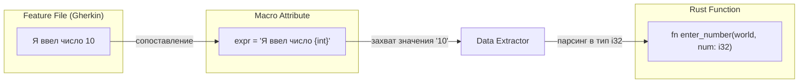

Шаг 3: Общая экосистема
========================

__Estimated time__: 2 days

В этих шагах описаны распространенные библиотеки и инструменты в экосистеме [Rust], необходимые для разработки приложений и библиотек.

> ❗️Перед выполнением этого шага необходимо выполнить все его подшаги.


После выполнения этих заданий вы сможете ответить на следующие вопросы:

 - [Какие возможности тестирования предлагает Rust и когда их следует использовать? Почему следует придерживаться стиля BDD?][23]
- [Что такое макросы? Чем они отличаются? Какие преимущества дает их использование? Когда следует писать макрос?][24]
- [Как работать с датой и временем в Rust? Как хранить время? Как передавать его другим приложениям?][25]
- [Как используются регулярные выражения в Rust? Когда их недостаточно? Как написать собственный парсер в Rust?][26]
- [В чём заключаются различия между итераторами и коллекциями в Rust? Каково назначение неизменяемых коллекций? Почему важно использовать параллельные коллекции?][27]
- [Что следует использовать для сериализации в Rust? Почему это хорошо или плохо?][28]
- [Как генерировать случайные числа в Rust? Какие гарантии генератора случайных чисел следует выбирать и когда?][29]
- [Что следует использовать для хеширования паролей в Rust? Как зашифровать сообщение с помощью Rust? Как следует сравнивать секретные значения и почему?][30]
- [Как организовано логирование в экосистеме Rust? Почему мне следует интересоваться структурированным логированием?][31]

- What should I use for building [CLI] interface in [Rust]? How can I organize a configuration for my application and why?
- Why multithreading is required for [Rust] programs and what problems does it solve? How threads concurrency differs with parallelism? How can I parallelize code in [Rust]?
- What is asynchronicity and what problems does it solve? How is it compared to threads concurrency? What is [Rust] solution for asynchronicity and why it has such design?
- What are actors? When are they useful?


## Task

Write a [CLI] tool for stripping [JPEG] images [metadata][21] and minimizing their size (a simplified analogue of [tinyjpg.com]).

Requirements:
- Accept input list of files and remote [URL]s via: either [CLI] arguments, [STDIN], or read it from a specified file ([EOL]-separated).
- Allow configuring how much images are processed at the same time.
- Allow configuring the output directory to store processed images in.
- Allow configuring the output [JPEG] quality of processed images.
- Read configuration with ascending priority from: a file (format is on your choice), [environment variables][22], [CLI] arguments. All are optional for specifying.
- Support `RUST_LOG` environment variable, allowing granular tuning of log levels per module.
- Print execution time in logs, so it's easy to see how much which operation takes during the execution.

If you have enough time after implementing base requirements, consider to add the following to your solution:
- Allow configuring download speed limit for images from remote [URL]s.
- Cover your implementation with unit and E2E tests.
- Support [PNG] images as well.
- Add comprehensive documentation to your code.


<hr>

### Какие возможности тестирования предлагает Rust и когда их следует использовать? Почему следует придерживаться стиля BDD?

В Rust тестирование — это не надстройка, а часть языка. Система типов и владения исключает целые классы багов, а встроенные инструменты позволяют закрыть пирамиду тестирования без внешних зависимостей.

#### 1. Возможности тестирования в Rust

    А. Модульные тесты (Unit Tests)
        
        Пишутся в том же файле, что и код, в специальном модуле `#[cfg(test)] mod tests`.

  - Когда: Для проверки логики отдельных функций, особенно приватных.
  - Плюс: Доступ к приватным полям и методам.

    Простой Unit Test:

```rust
// 1. Основная функция, которую мы хотим протестировать
pub fn add(a: i32, b: i32) -> i32 {
    a + b
}

// 2. Модуль тестов. Атрибут #[cfg(test)] говорит Rust: 
// "Компилируй это только тогда, когда запущена команда cargo test"
#[cfg(test)]
mod tests {
    // Импортируем всё из внешнего модуля (нашу функцию add)
    use super::*;

    // 3. Конкретный тест
    #[test]
    fn test_add_positive_numbers() {
        // Утверждение: результат должен быть равен 4
        assert_eq!(add(2, 2), 4);
    }

    #[test]
    fn test_add_negative_numbers() {
        assert_eq!(add(-1, -1), -2);
    }

    // Тест, который ожидает панику (ошибку)
    #[test]
    #[should_panic(expected = "attempt to divide by zero")]
    fn test_division_by_zero() {
        let _ = 1 / 0;
    }
}
```

    Запуск Unit Test:
```bash
cargo test
```

    Б. Интеграционные тесты (Integration Tests)

        Располагаются в отдельной папке tests/ в корне проекта.

  - Когда: Для проверки того, как ваш крейт выглядит «снаружи». Они вызывают только публичный API.
  - Плюс: Гарантируют, что пользователь вашей библиотеки сможет её использовать.

    Структура проекта:
```
my_app/
├── Cargo.toml
├── src/
│   └── lib.rs      <-- Код здесь (должен быть lib, а не только main)
└── tests/
    └── my_test.rs  <-- Интеграционный тест здесь
```

    Код в src/lib.rs  (Библиотека)
```rust
pub fn add_numbers(a: i32, b: i32) -> i32 {
    a + b
}
```
    Код в tests/my_test.rs (Тест):

    Интеграционные тесты работают только с библиотечными крейтами или со всем приложением в целом.

```rust
// Импортируем нашу библиотеку как внешний пользователь
use my_app::add_numbers;

#[test]
fn test_integration_add() {
    // Вызываем публичную функцию
    let result = add_numbers(10, 20);
    
    // Проверяем результат
    assert_eq!(result, 30);
}

#[test]
fn test_with_setup() {
    // Здесь обычно инициализируют окружение, например БД или логи
    let data = 5;
    assert!(add_numbers(data, 5) > 0);
}
```
    Запуск Integration Tests
```bash
cargo test
```

    В. Документационные тесты (Doc-tests)

        Примеры кода прямо в комментариях ///.

  - Когда: Всегда. Это «живая» документация, которая падает, если код устарел.
  - Плюс: Вы убиваете двух зайцев: обучаете пользователя и тестируете API.

    Содержимое src/lib.rs:
```rust
/// Складывает два числа.
///
/// # Examples
///
/// ```
/// use my_app::add; // Замените my_app на имя вашего крейта в Cargo.toml
/// let result = add(2, 3);
/// assert_eq!(result, 5);
/// ```
pub fn add(a: i32, b: i32) -> i32 {
    a + b
}
```
    Запуск Doc-test:
```bash
cargo test --doc
```

    Г. Property-based Testing (через крейт proptest)

        Вместо конкретных значений вы задаете стратегию (например, «любая строка Unicode»).
        
  - Когда: Для поиска пограничных случаев (edge cases), о которых вы даже не догадывались.

    Cargo.toml
```toml
[dev-dependencies]
proptest = "1.6"
```

```rust
use proptest::prelude::*;

fn add(a: i32, b: i32) -> i32 {
    // Представим, что здесь сложная логика
    a.wrapping_add(b)
}

// 1. Используем макрос proptest!
proptest! {
    // 2. Описываем входные данные: "любые i32 для a и b"
    #[test]
    fn test_add_is_commutative(a in any::<i32>(), b in any::<i32>()) {
        // 3. Проверяем свойство: коммутативность (от перестановки слагаемых сумма не меняется)
        prop_assert_eq!(add(a, b), add(b, a));
    }

    #[test]
    fn test_add_with_zero(a in any::<i32>()) {
        // Свойство: прибавление нуля не меняет число
        prop_assert_eq!(add(a, 0), a);
    }
}
```
    Заруск Property-based Test:
```bash
cargo test
```

#### 2. Почему стоит придерживаться стиля BDD?

BDD (Behavior-Driven Development:) — это разработка основанная поведение. В Rust для этого часто используют крейт cucumber или k8s-openapi для сложных систем.

  Преимущества BDD:

  1. Общий язык: Тесты пишутся на языке «Дано — Когда — Тогда» (Given-When-Then), понятном и программисту, и бизнесу.
  2. Фокус на требованиях: Вы тестируете не как реализована функция, а какую задачу она решает. Это делает тесты устойчивыми к рефакторингу.
  3. Живая спецификация: BDD-сценарии служат актуальным описанием того, как работает система.

    Структуры проекта:
```
my_project/
├── Cargo.toml
├── src/lib.rs
└── tests/
    ├── cucumber.rs          <-- Код тестов
    └── features/
        └── calculator.feature <-- Описание поведения
```

    Описание функции, файл tests/features/calculator.feature:
```gherkin
Feature: Калькулятор

  Scenario: Сложение двух чисел
    Given Я ввел число 10
    And Я ввел число 5
    When Я нажимаю кнопку сложения
    Then Результат должен быть 15
```
Cargo.toml:
```toml
[dev-dependencies]
cucumber = "0.20"
tokio = { version = "1", features = ["full"] } # Cucumber в Rust асинхронен
```

tests/cucumber.rs:
```rust
use cucumber::{given, when, then, World};

// 1. "Мир" (World) — это состояние нашего теста между шагами
#[derive(Debug, Default, World)]
pub struct CalculatorWorld {
    inputs: Vec<i32>,
    result: i32,
}

// 2. Описываем шаги (Steps)
#[given(expr = "Я ввел число {int}")]
fn enter_number(world: &mut CalculatorWorld, num: i32) {
    world.inputs.push(num);
}

#[when("Я нажимаю кнопку сложения")]
fn click_add(world: &mut CalculatorWorld) {
    world.result = world.inputs.iter().sum();
}

#[then(expr = "Результат должен быть {int}")]
fn check_result(world: &mut CalculatorWorld, expected: i32) {
    assert_eq!(world.result, expected);
}

// 3. Запуск рантайма
#[tokio::main]
async fn main() {
    CalculatorWorld::run("tests/features").await;
}
```
  В методологии BDD и библиотеке cucumber-rs ключевые слова __Given__, __When__, __Then__ и __And__ служат для удобства чтения человеком, но для программного движка они работают по принципу сопоставления с шаблоном.

  Примечание:
   - Ключевое слово __And__: В языке Gherkin (файлы .feature) слово __And__ (или И в русской локализации) просто повторяет тип предыдущего шага.

    __Связь между {int} в атрибуте и аргументом num в функции:__

   Связь между {int} в атрибуте и аргументом num в функции является позиционной. В Rust 2026 библиотека cucumber-rs использует процедурные макросы, чтобы автоматически «прошить» передачу данных.

   Вот как выглядит эта связь на схеме:

  Порядок обработки:

  1. Захват (Capture): Библиотека видит в шаблоне плейсхолдер {int}. Когда она встречает строку «Я ввел число 10», она «вырезает» текст 10.
  2. Сопоставление с аргументами:
    1. Первый аргумент функции всегда world (состояние теста). Он игнорируется при поиске данных из строки.
    2. Второй аргумент функции — num: i32. Библиотека видит, что в шаблоне есть один плейсхолдер, а в функции есть один дополнительный аргумент после world.
  3. Автоматическая конвертация: cucumber-rs вызывает метод FromStr для типа i32, превращая строку "10" в число 10.
  4. Вызов: Библиотека выполняет вызов enter_number(current_world, 10).


#### 3. Сводная таблица применения

|Тип теста|Инструмент|Когда использовать?|
|---------|----------|-------------------|
|Unit|#[test]|Логика мелких функций и алгоритмов.|
|Integration|tests/*.rs|Проверка публичного API и взаимодействия модулей.|
|Doc-test|///|Короткие примеры использования для документации.|
|BDD|cucumber|Описание бизнес-процессов (напр. «Оформить заказ»).|

#### Золотое правило Rust-тестирования:

Сначала полагайтесь на систему типов (чтобы ошибку нельзя было выразить в коде), затем на модульные тесты для логики, и в конце на интеграционные BDD-сценарии для проверки работы всей системы в сборе\.

<hr>

### Что такое макросы? Чем они отличаются? Какие преимущества дает их использование? Когда следует писать макрос?

В Rust макросы — это инструменты метапрограммирования, которые позволяют писать код, генерирующий другой код. В отличие от функций, которые работают со значениями, макросы работают с самой структурой программы (токенами и синтаксическим деревом).

#### 1. Какие типы макросов существуют?

В Rust есть две принципиально разные категории макросов:

  А. Декларативные макросы (macro_rules!)

   Самый распространенный тип. Работают по принципу «сопоставления с образцом» (pattern matching).
   - Как работают: Вы описываете шаблон (как в match), и если вызываемый код ему соответствует, он заменяется на тело макроса.
   - Пример: vec![1, 2, 3], println!(), log!().

  Б. Процедурные макросы (Procedural Macros)

  Это функции на Rust, которые принимают код как входные данные и возвращают измененный код.

  - #[derive(...)]: Генерирует код автоматически (например, Deserialize для структур).
  - Атрибуты: #[tokio::main], #[test].
  - Функциональные: Похожи на декларативные, но имеют доступ к полноценному парсингу через крейты syn и quote.

#### 2. Чем макросы отличаются от функций?

|Характеристика|Функция|Макрос|
|--------------|-------|------|
|Выполнение|Во время работы программы (Runtime).|Во время компиляции (Compile-time).|
|Аргументы|Фиксированное количество и типы.|Переменное (Variadic) и любые токены.|
|Синтаксис|Ограничен правилами языка.|Может создавать свои правила (DSL).|
|Область видимости|Не может менять структуру программы.|Может генерировать новые типы, модули.|

#### 3. Какие преимущества они дают?

  1. DRY (Don't Repeat Yourself): Позволяют избежать копипасты там, где функции бессильны (например, реализация одного и того же трейта для 10 разных структур).
  2. Абстракция над синтаксисом: Позволяют создавать предметно-ориентированные языки (DSL - Domain Specific Language). Например, SQL-запросы прямо в коде или описание HTML-шаблонов.
  3. Нулевая стоимость в рантайме: Весь тяжелый труд по генерации кода происходит при компиляции. Процессор выполняет уже готовый, оптимизированный код.
  4. Безопасность: Макросы в Rust «гигиеничны» (hygienic) — они не смешивают свои внутренние переменные с переменными вашего кода, предотвращая случайные баги.

#### 4. Когда СЛЕДУЕТ писать макрос?

Макросы — это мощный, но сложный инструмент. Их стоит писать, если:

- Нужно переменное число аргументов: Как в println! или join!.
- Нужно захватить контекст вызова: Например, автоматически получить имя файла (file!()) или номер строки (line!()) для логов.
- Нужно реализовать трейт для многих типов: Если вы видите, что копируете один и тот же код для 5 структур, напишите derive макрос или macro_rules!.
- Вы создаете DSL: Если стандартный синтаксис Rust слишком громоздок для вашей специфической задачи (например, парсинг сложных протоколов) [2.2].

<hr>

### Как работать с датой и временем в Rust? Как хранить время? Как передавать его другим приложениям?

#### 1. Как хранить и измерять время

Для разных задач используются разные типы данных:

- std::time::Instant: «Монотонное» время. Не зависит от перевода часов.
    - Для чего: Замер длительности операций (профилирование).
- std::time::SystemTime: «Настенное» время ОС. Может «прыгать» назад при синхронизации через NTP.
    - Для чего: Метки времени создания файлов, логов.
- chrono::DateTime: Золотой стандарт индустрии. Поддерживает часовые пояса (UTC, Local) и форматирование.
    - Для чего: Бизнес-логика, базы данных [1.1].

#### 2. Как работать (Крейт Chrono)

Добавьте в Cargo.toml: `chrono = { version = "0.4", features = ["serde"] }`

```rust
use chrono::{Utc, Local, DateTime, TimeZone};

// Текущее время в UTC
let now_utc = Utc::now(); 

// Конвертация в локальное время
let now_local: DateTime<Local> = DateTime::from(now_utc);

// Создание конкретной даты
let dt = Utc.with_ymd_and_hms(2026, 2, 25, 12, 0, 0).unwrap();
```

#### 3. Как передавать другим приложениям

Для совместимости с другими языками и системами используйте два подхода:

  1. ISO 8601 / RFC 3339 (Строки): Понятно человеку и большинству API.
    1. Пример: "2026-02-25T15:45:00Z"
    2. В Rust: now.to_rfc3339().
  2. Unix Timestamp (Числа): Секунды/миллисекунды с 1 января 1970 года. Самый быстрый и компактный способ для БД и бинарных протоколов.
    1. В Rust: now.timestamp() (секунды) или timestamp_millis().

#### 4. Передача через Serde (JSON/TOML)

Если вы используете serde, chrono автоматически сериализует дату в строку RFC 3339.

```rust
#[derive(serde::Serialize, serde::Deserialize)]
struct Event {
    name: String,
    ts: DateTime<Utc>, // В JSON будет: "2026-02-25T..."
}
```

#### Рекомендация
Если вам нужна экстремальная производительность или вы работаете в no_std (embedded), посмотрите на крейт time. Он строже относится к проверке типов и часто работает быстрее chrono в специфических сценариях.

<hr>

### Как используются регулярные выражения в Rust? Когда их недостаточно? Как написать собственный парсер в Rust?

В Rust работа с текстом делится на три уровня сложности: от простого поиска по шаблону до создания полноценных языков программирования.

#### 1. Регулярные выражения (Regex)

Для регулярных выражений стандартом является крейт regex. Он гарантирует выполнение за линейное время __O(n)__, что защищает от атак типа «отказ в обслуживании» (ReDoS).

Как использовать:

```rust
use regex::Regex;

let re = Regex::new(r"(\d{4})-(\d{2})-(\d{2})").unwrap();
let text = "Дата: 2026-02-25";

if let Some(caps) = re.captures(text) {
    println!("Год: {}, Месяц: {}", &caps[1], &caps[2]);
}
```

#### 2. Когда Regex недостаточно?

Регулярные выражения хороши для плоских строк, но они бессильны, если:

- Вложенность: Вы не можете распарсить HTML, XML или JSON с помощью Regex (проблема контекстно-свободных грамматик) [1.1].
- Сложная логика: Если поведение парсера зависит от предыдущих данных (например, «прочитать N байт, а затем интерпретировать их как число»).
- Производительность: Regex требует компиляции в рантайме. Для критических узлов самописный парсер на Zero-copy будет в разы быстрее.
- Читаемость: Огромные «регулярки» превращаются в «write-only» код, который невозможно поддерживать.

#### 3. Как написать собственный парсер?

Вместо того чтобы писать парсер «с нуля» на циклах, в Rust используют парсер-комбинаторы. Это функции-кирпичики, которые вы собираете в сложную логику.

  А. [Winnow](https://docs.rs/winnow/latest/winnow/) (Рекомендуемый выбор)

Это современный наследник nom. Он очень быстрый и позволяет писать парсеры в стиле «изменяемого состояния», что привычно для Rust.

   - Для чего: Бинарные протоколы, сложные форматы данных.
  
  Б. Pest (Для грамматик)

Вы описываете правила в отдельном файле .pest (в стиле [PEG](wikipedia.org, _анализирующая_выражение)).

   - Для чего: Свои языки программирования, сложные конфигурационные файлы.

  В. Logos (Сверхбыстрый лексер)

Если вам нужно просто разбить текст на токены (числа, слова, скобки), logos генерирует на этапе компиляции невероятно быстрые конечные автоматы.

#### Сводная таблица выбора

|Инструмент|Сложность|Скорость|Применение|
|----------|---------|--------|----------|
|str methods|Низкая|Макс.|Поиск подстроки, split, trim.|
|regex|Средняя|Средняя|Валидация почты, дат, логов.|
|winnow|Высокая|Высокая|Парсинг протоколов (Redis, HTTP).|
|pest|Высокая|Средняя|Создание DSL и языков (JSON, SQL).|

__Итог__: Если структура текста сложнее одного предложения или имеет вложенность — переходите на winnow. Это сэкономит недели отладки.

<hr>

### В чём заключаются различия между итераторами и коллекциями в Rust? Каково назначение неизменяемых коллекций? Почему важно использовать параллельные коллекции?

В Rust понимание этих различий критично для написания кода, который эффективно использует как память, так и многоядерные процессоры.

#### 1. Различия между итераторами и коллекциями

Основное различие заключается в владении данными

|Характеристика|Коллекции (Vec, HashMap)|Итераторы (Iter, Map)|
|--------------|------------------------|---------------------|
|Хранение|Владеют данными и хранят их в памяти (обычно в куче).|	Не хранят данные, а лишь предоставляют способ доступа к ним.|
|Вычисления|Данные уже вычислены и занимают место.|Ленивые: вычисления происходят только в момент вызова .next().|
|Размер|Всегда конечны и ограничены памятью.|Могут быть бесконечными (например, (0..)).|
|Стоимость|Высокая (аллокация памяти).|Нулевая (Zero-cost abstraction), компилятор превращает их в оптимальные циклы.|

__Назначение:__ Коллекции нужны для структурирования данных, а итераторы — для их обработки без создания промежуточных копий в памяти.

#### 2. Назначение неизменяемых (персистентных) коллекций

В Rust под «неизменяемыми коллекциями» (например, из крейта [im](https://docs.rs/im/latest/im/)) понимают персистентные структуры данных.

- Структурное разделение (Structural Sharing): Когда вы «изменяете» такую коллекцию, она не копирует все данные, а создает новую версию, которая разделяет большую часть узлов со старой.
- Зачем они нужны:
    1. История состояний: Легко реализовать функции «Undo/Redo» (отмена действий), так как старые версии коллекции остаются валидными и дешевыми.
    2. Функциональное программирование: Позволяют писать код без побочных эффектов, где данные никогда не меняются «на месте».
    3. Безопасность в многопоточности: Несколько потоков могут безопасно работать со своими «версиями» данных без блокировок (Mutex) [2.1].

#### 3. Почему важно использовать параллельные коллекции?

Параллельные (Concurrent) коллекции (например, [DashMap](https://docs.rs/dashmap/latest/dashmap/) или crossbeam-skiplist) спроектированы для работы в высоконагруженных многопоточных средах.

- Уход от «бутылочного горлышка»: Обычная коллекция внутри мьютекса (Mutex<HashMap>) позволяет работать только одному потоку одновременно. Параллельные коллекции используют шардирование (разделение на независимые части), позволяя десяткам ядер писать в одну таблицу параллельно.
- Производительность: Они минимизируют время ожидания блокировок, что критично для серверов с миллионами запросов в секунду.
- Масштабируемость: С ростом количества ядер процессора производительность системы с параллельными коллекциями растет линейно, в то время как система с одним Mutex начинает деградировать из-за конфликтов доступа.

#### Резюме

1. Используйте итераторы для обработки данных, чтобы не нагружать память.
2. Используйте персистентные коллекции, если вам нужно хранить версии данных (например, в редакторах или сложных алгоритмах).
3. Используйте параллельные коллекции (DashMap) в сетевых сервисах, чтобы задействовать все ядра вашего CPU без блокировок всего приложения.

<hr>

### Что следует использовать для сериализации в Rust? Почему это хорошо или плохо?

Ответом для 99% проектов по-прежнему остается Serde. Это абсолютный золотой стандарт сериализации в экосистеме Rust.

Однако, в зависимости от ваших требований к производительности (например, Zero-Copy или No-Parsing), существуют современные альтернативы.

#### 1. Стандарт индустрии: [Serde](https://docs.rs/serde/latest/serde/)

Serde — это фреймворк для эффективной и универсальной сериализации и десериализации структур данных Rust.

- Почему это хорошо:
    - Экосистема: Его поддерживает почти каждый крейт (SQLx, Axum, MongoDB).
    - Универсальность: Один #[derive(Serialize, Deserialize)] работает для JSON, TOML, YAML, CBOR и других форматов.
    - Магия компиляции: Использует макросы для генерации кода, что означает отсутствие рефлексии в рантайме и скорость, близкую к C.
- Почему это плохо:
    - Размер бинарника: Интенсивное использование макросов может увеличить время компиляции и раздуть размер исполняемого файла.
    - Ограниченный Zero-Copy: Хотя он поддерживает заимствование &str, ему всё равно нужно «распарсить» данные в вашу структуру.

#### 2. Для экстремальной скорости: [rkyv](https://docs.rs/rkyv/latest/rkyv/)

Если вы строите систему высокочастотного трейдинга, игровой движок или масштабный кэш, вам нужно Zero-Parsing.

- Почему это хорошо:
    - Zero-Copy: Он отображает байты напрямую в память. Вы не «десериализуете» — вы просто обращаетесь к данным там, где они лежат в буфере.
    - Скорость: Часто в 10–100 раз быстрее Serde для больших наборов данных, так как процессор не тратит ресурсы на загрузку структуры.
- Почему это плохо:
    - Сложность: Требует осторожного обращения с выравниванием байтов и валидацией (через bytecheck).
    - Совместимость: Это не универсальный формат типа JSON, а специализированный бинарный формат.

#### 3. Для микроконтроллеров и легкости: [musli](https://docs.rs/musli/latest/musli/)

Более новый игрок, который стремится быть более легкой и гибкой альтернативой Serde.

- Почему это хорошо:
    - Контекстная зависимость: Отлично подходит для передачи состояния через процесс сериализации (с чем у Serde возникают трудности).
    - Быстрая компиляция: Спроектирован так, чтобы меньше нагружать компилятор Rust, чем тяжелые макросы Serde.
- Почему это плохо:
    - Нишевость: Гораздо меньшее сообщество и меньше сторонних интеграций по сравнению с Serde.

#### Сводная таблица на 2026 год

|Сценарий использования|Рекомендуемый крейт|
|Web API / Конфиг-файлы	Serde|(с serde_json или toml)|
|Базы данных / Big Data|rkyv или Bincode|
|Микроконтроллеры|Postcard (на базе Serde для no_std)|
|Скорость + Контекст|musli|

Совет профи: Если используете Serde, всегда включайте функцию derive в Cargo.toml:

```toml
serde = { version = "1.0", features = ["derive"] }
```
<hr>

### Как генерировать случайные числа в Rust? Какие гарантии генератора случайных чисел следует выбирать и когда?

В Rust генерация случайных чисел не встроена в стандартную библиотеку (std), чтобы не раздувать бинарные файлы. Стандартом де-факто является крейт [rand](https://docs.rs/rand/latest/rand/).

#### 1. Как генерировать числа на практике

Самый быстрый способ получить случайное значение — использовать `thread_rng()`.

Cargo.toml
```toml
[package]
name = "step_3"
version = "0.1.0"
edition = "2024"
publish = false

[dependencies]
rand = "0.8.0"
```

```rust
use rand::{self, prelude::*};

fn main() {
    let mut rng = rand::thread_rng();

    // 1. Случайное число (целое или с плавающей точкой)
    let n: u32 = rng.gen_range(0..100);
    println!("n: {}", n) ;

    let x: f64 = rng.r#gen(); // от 0.0 до 1.0
    println!("x: {}", x) ;

    // 2. Случайный выбор из списка
    let choices = ["Rust", "Go", "C++"];
    if let Some(&lang) = choices.choose(&mut rng) {
        println!("Выбран язык: {}", lang);
    }

    // 3. Перемешивание вектора
    let mut nums = vec![1, 2, 3, 4, 5];
    nums.shuffle(&mut rng);
    println!("{:?}", nums) ;
}
```

#### 2. Типы генераторов и их гарантии

Выбор генератора — это всегда компромисс между безопасностью и скоростью.

  А. thread_rng() (Криптографически стойкий — CSPRNG)

   Это выбор по умолчанию для 99% задач.

   - Гарантии: Использует алгоритм ChaCha12. Он криптографически безопасен: зная предыдущие числа, невозможно предсказать следующее.
   - Когда использовать: Почти всегда. Токены сессий, игровые механики, общие задачи.

  Б. SmallRng (Быстрый, но небезопасный)

  Если вам нужно генерировать миллионы чисел в секунду (например, в симуляциях).

  - Гарантии: Никаких гарантий безопасности. Он предсказуем. Использует алгоритм Pcg64 или подобные.
  - Когда использовать: Монте-Карло симуляции, физика, визуальные эффекты (частицы), где важна только скорость.

  В. StdRng (Предсказуемо лучший CSPRNG - __Cryptographically Secure Pseudo-Random Number Generator__)

  - Гарантии: Самый надежный криптографический генератор для текущей платформы.
  - Когда использовать: Когда вам нужен CSPRNG, но вы хотите инициализировать его своим «зерном» (SeedableRng) для детерминированного тестирования.
  
#### 3. Сводная таблица выбора

|Ситуация|Генератор|Метод|Безопасность|
|--------|---------|-----|------------|
|Обычное приложение|thread_rng|rand::thread_rng()|Высокая (CSPRNG)|
|Безопасность / Крипто|OsRng|rand::rngs::OsRng|Максимальная (Hardware)|
|Игры / Симуляции|SmallRng|rand::rngs::SmallRng|Низкая (Зато очень быстрый)|
|Тесты (Воспроизводимые)|StdRng|StdRng::from_seed(seed)|Высокая|

#### 4. Важное предостережение

Никогда не используйте SmallRng для генерации паролей, ключей или даже ID заказов, если они должны быть секретными. Современные инструменты анализа могут вычислить внутреннее состояние такого генератора всего по нескольким выданным числам.

<hr>

### Что следует использовать для хеширования паролей в Rust? Как зашифровать сообщение с помощью Rust? Как следует сравнивать секретные значения и почему?

В Rustгоду для безопасности паролей и данных используются специализированные библиотеки из проекта [RustCrypto](https://github.com/RustCrypto), так как стандартная библиотека (std) не содержит криптографических примитивов.

#### 1. Что использовать для хеширования паролей?

Никогда не используйте обычные хеш-функции (SHA-256, MD5). Используйте Argon2id — современный стандарт, устойчивый к перебору на GPU и ASIC.

- Библиотека: [argon2](https://docs.rs/argon2/latest/argon2/)
- Почему: Он «медленный» и требует много памяти, что делает атаку перебором (brute-force) экономически невыгодной.

```rust
use argon2::{
        Argon2,
        password_hash::{
                SaltString,
                PasswordHasher,
                PasswordVerifier,
                PasswordHash
            },
        rand_core::OsRng
    };

let password = b"my_super_password";
let salt = SaltString::generate(&mut OsRng);

// Хеширование
let argon2 = Argon2::default();
let password_hash = argon2.hash_password(password, &salt).unwrap().to_string();

// Проверка
let parsed_hash = PasswordHash::new(&password_hash).unwrap();
assert!(argon2.verify_password(password, &parsed_hash).is_ok());
```

#### 2. Как зашифровать сообщение?

Для шифрования сообщений (текста, файлов) используйте Authenticated Encryption (AEAD). Это гарантирует не только секретность, но и то, что данные не были изменены.

- Алгоритм: AES-256-GCM или ChaCha20-Poly1305.
- Библиотека: aes-gcm или chacha20poly1305 [2.1].

```rust
use chacha20poly1305::{ChaCha20Poly1305, Key, Nonce, aead::{Aead, KeyInit}};

let key = Key::from_slice(b"an incredibly savvy secret key!"); // 32 байта
let cipher = ChaCha20Poly1305::new(key);
let nonce = Nonce::from_slice(b"unique nonce"); // 12 байт

let ciphertext = cipher.encrypt(nonce, b"secret message".as_ref()).unwrap();
let plaintext = cipher.decrypt(nonce, ciphertext.as_ref()).unwrap();
```

#### 3. Как сравнивать секретные значения?

Секреты (токены, пароли, подписи) нужно сравнивать только за постоянное время (Constant-Time).

- Почему: Обычное сравнение (==) обрывается на первом несовпадающем байте. Злоумышленник может замерить время ответа сервера и посимвольно угадать ваш секрет (Timing Attack).
- Библиотека: [subtle](https://docs.rs/subtle/latest/subtle/)

```rust
use subtle::ConstantTimeEq;

let secret = b"expected_token";
let input = b"user_input_token";

// ct_eq гарантирует, что сравнение всегда занимает одинаковое время
if input.ct_eq(secret).unwrap_u8() == 1 {
    println!("Доступ разрешен");
}
```

Итог: Для паролей — Argon2, для шифрования — AEAD, для сравнения — subtle.

<hr>

### Как организовано логирование в экосистеме Rust? Почему мне следует интересоваться структурированным логированием?

Логирование в Rust построено на четком разделении обязанностей между тем, кто отправляет сообщение, и тем, куда оно попадает. Это позволяет библиотекам и приложениям работать в едином информационном поле.

#### 1. Как организовано логирование

Экосистема разделена на два уровня: Фасад (интерфейс) и Реализация (бэкенд).

 А. Фасад (Интерфейс)

 Это легкие крейты, которые предоставляют макросы (info!, error!). Библиотеки зависят только от них.

 - log: Классический фасад. Простой, быстрый, текстоцентричный.
 - tracing: Современный стандарт. Поддерживает асинхронность и контекст (спаны).

 Б. Реализация (Подписчики/Логгеры)

 Это то, что вы настраиваете один раз в main.rs. Они решают, куда пойдет текст: в консоль, в файл или в облако.

 - Для log: env_logger, fern.
 - Для tracing: tracing-subscriber, tracing-appender.

#### 2. Что такое структурированное логирование?

  Обычное логирование — это просто текст:

```
User 42 logged in from 1.1.1.1
```

<hr>


[BDD]: https://en.wikipedia.org/wiki/Behavior-driven_development
[CLI]: https://en.wikipedia.org/wiki/Command-line_interface
[EOL]: https://en.wikipedia.org/wiki/Newline
[JPEG]: https://en.wikipedia.org/wiki/JPEG
[PNG]: https://en.wikipedia.org/wiki/PNG
[Rust]: https://www.rust-lang.org
[STDIN]: https://en.wikipedia.org/wiki/Standard_streams#Standard_input_(stdin)
[tinyjpg.com]: https://tinyjpg.com
[URL]: https://en.wikipedia.org/wiki/URL

[21]: https://picvario.com/what-is-image-metadata-role-and-benefits
[22]: https://en.wikipedia.org/wiki/Environment_variable

[23]: https://github.com/ArthurPronota/rust-incubator/tree/main/3_ecosystem#какие-возможности-тестирования-предлагает-rust-и-когда-их-следует-использовать-почему-следует-придерживаться-стиля-bdd
[24]: https://github.com/ArthurPronota/rust-incubator/tree/main/3_ecosystem#что-такое-макросы-чем-они-отличаются-какие-преимущества-дает-их-использование-когда-следует-писать-макрос
[25]: https://github.com/ArthurPronota/rust-incubator/tree/main/3_ecosystem#как-работать-с-датой-и-временем-в-rust-как-хранить-время-как-передавать-его-другим-приложениям
[26]: https://github.com/ArthurPronota/rust-incubator/tree/main/3_ecosystem#как-используются-регулярные-выражения-в-rust-когда-их-недостаточно-как-написать-собственный-парсер-в-rust
[27]: https://github.com/ArthurPronota/rust-incubator/tree/main/3_ecosystem#в-чём-заключаются-различия-между-итераторами-и-коллекциями-в-rust-каково-назначение-неизменяемых-коллекций-почему-важно-использовать-параллельные-коллекции
[28]: https://github.com/ArthurPronota/rust-incubator/tree/main/3_ecosystem#что-следует-использовать-для-сериализации-в-rust-почему-это-хорошо-или-плохо
[29]: https://github.com/ArthurPronota/rust-incubator/tree/main/3_ecosystem#как-генерировать-случайные-числа-в-rust-какие-гарантии-генератора-случайных-чисел-следует-выбирать-и-когда
[30]: https://github.com/ArthurPronota/rust-incubator/tree/main/3_ecosystem#что-следует-использовать-для-хеширования-паролей-в-rust-как-зашифровать-сообщение-с-помощью-rust-как-следует-сравнивать-секретные-значения-и-почему
[31]: https://github.com/ArthurPronota/rust-incubator/tree/main/3_ecosystem#как-организовано-логирование-в-экосистеме-rust-почему-мне-следует-интересоваться-структурированным-логированием