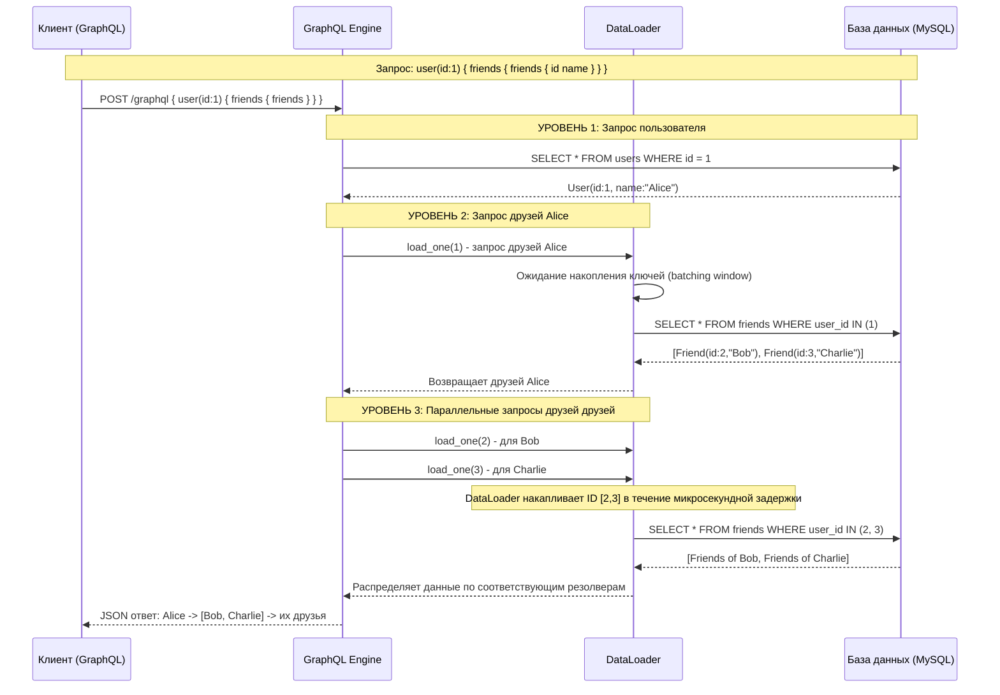

Шаг 4: Экосистема бэкэнда
=========================

__Estimated time__: 3 days

В этих шагах описаны распространенные библиотеки и инструменты в экосистеме [Rust], необходимые для разработки веб-бэкенда.

> ❗️Перед завершением этого шага необходимо выполнить все его подшаги.

После выполнения этих заданий вы сможете ответить на следующие вопросы:
- [Как и зачем мне взаимодействовать с базами данных в приложении на Rust? Как организовать миграции для моего проекта?][0401]
- [Что следует использовать для реализации HTTP-сервера в Rust, когда и почему? А как насчет WebSocket-соединений?][0402]
- [Какие существуют варианты для отправки HTTP-запросов (включая запросы WebSocket)?][0403]
- [Что такое RPC (Remote procedure call)? Назовите несколько наиболее распространенных технологий, их преимущества и недостатки, объясните, какая из них может быть использована в каких обстоятельствах, и для чего и где она наиболее подходит?][0404]

## Task

Напишите простой API-сервер на основе [GraphQL] со следующей моделью данных:
- Объект `User` имеет поля `id` (уникальный), `name` (уникальный) и `friends` (список других пользователей `User`).
- `User` может пройти аутентификацию, используя свой `password`.

Требования к API:
- Возможность регистрации пользователей.
- Возможность аутентификации пользователей.
- Возможность получить информацию об одном пользователе и всех его друзьях (включая их друзей) (требуется авторизация).
- Возможность добавлять пользователей в список друзей и удалять их оттуда (требуется авторизация).

Выбор веб-фреймворков, инструментов и баз данных остается за вами. Старайтесь упрощать задачи, чтобы уложиться в отведенное время.

Если после внедрения базовых требований у вас останется достаточно времени, рассмотрите возможность добавления в ваше решение следующих элементов:
- Предоставьте миграции для схемы базы данных (если это возможно).
- Добавьте подробную документацию к вашему коду и [API] и сгенерируйте её в формате [HTML].
- Покройте свою реализацию модульными и E2E (End-to-End) тестами.
- Реализовать [GraphQL] запрос [depth limiting][21].
- Используйте [dataloading][22] (загрузку данных паттернами группировки), чтобы оптимизировать взаимодействие с базой данных в [GraphQL] - резолверах (В контексте GraphQL, резолвер (resolver) — это обычная функция на бэкенде, которая отвечает за получение данных для конкретного поля в вашем запросе.).

#### Блок схема работы [dataloading][22]

<a name="q-0401"><h3>Как и зачем мне взаимодействовать с базами данных в приложении на Rust? Как организовать миграции для моего проекта?</h3></a>

Взаимодействие с базами данных в Rust позволяет строить высокопроизводительные и безопасные бэкенд-сервисы, используя строгую типизацию для предотвращения ошибок на этапе компиляции.

#### Зачем использовать Rust для работы с БД?

- Безопасность памяти и типов: Rust гарантирует отсутствие утечек памяти и состояния гонки при многопоточном доступе к данным.
- Производительность: Минимальные накладные расходы (zero-cost abstractions) позволяют достичь скорости C++ при работе с запросами.
- Проверка запросов при компиляции: Некоторые инструменты (например, SQLx) проверяют синтаксис ваших SQL-запросов и типы данных еще до запуска приложения. 

#### Как взаимодействовать с БД?

Выбор инструмента зависит от нужного уровня абстракции:

1. SQLx (Query Builder / SQL-first):
   - Пишете чистый SQL.
   - Главная фишка: Макрос sqlx::query! проверяет ваши запросы на соответствие реальной схеме БД во время компиляции.
   - Полностью асинхронный и не требует сложной настройки моделей.
2. Diesel (ORM / Query Builder):
   - Строгая типизация таблиц через макросы.
   - Самая высокая производительность среди ORM в Rust.
   - Требует предварительной генерации схемы (schema.rs), что делает код очень предсказуемым.
3. SeaORM (Async ORM):
   - Построен на базе SQLx, но предоставляет привычный объектно-реляционный интерфейс (как в Hibernate или Entity Framework).
   - Удобен для быстрой разработки сложных бизнес-сущностей. 

#### Как организовать миграции?

Миграции позволяют версионировать изменения схемы БД (создание таблиц, добавление колонок) аналогично Git.

- SQLx: Имеет встроенную систему миграций. Вы создаете папку migrations/, добавляете туда SQL-файлы вида 20231010_create_users.sql, и вызываете sqlx migrate run через CLI или прямо в коде при старте приложения.
- Diesel: Использует собственный CLI инструмент. Команда diesel migration run применяет изменения, а структура БД фиксируется в коде проекта.
- Многоразовые скрипты: Миграции обычно содержат блоки up (применение изменений) и down (откат). Это гарантирует, что база данных на сервере будет идентична вашей локальной копии. 

<a name="q-0402"><h3>Что следует использовать для реализации HTTP-сервера в Rust, когда и почему? А как насчет WebSocket-соединений?</h3></a>

Для реализации HTTP-сервера в Rust сейчас есть три лидера. Выбор зависит от того, что вам важнее: стабильность, скорость разработки или полный контроль.

#### 1. Axum (Рекомендация №1)

Это современный стандарт, который разрабатывается командой tokio (основная асинхронная среда Rust).

- Когда: В 90% случаев для новых проектов и микросервисов.
- Почему: Использует систему типов Rust для обработки запросов (Extractors). Если вы ошиблись в аргументах функции-обработчика, код просто не скомпилируется. Очень гибкий и легко расширяемый через слои (middleware) экосистемы tower.

#### 2. Actix-web

Старый, проверенный и экстремально быстрый фреймворк.

- Когда: Если нужна максимальная пропускная способность и проверенная годами стабильность.
- Почему: Построен на собственной системе акторов. У него огромное сообщество и куча готовых примеров. Он стабильно занимает топовые места в мировых бенчмарках (TechEmpower).

#### 3. Rocket

Фреймворк с упором на удобство разработчика (DX).

- Когда: Для прототипов или если вы переходите с Flask (Python) или Ruby on Rails.
- Почему: Минимум «бойлерплейта» (шаблонного кода). Использует макросы, чтобы сделать код максимально чистым и понятным. Однако он чуть менее гибкий, чем Axum.

#### А что с WebSocket?

В Rust работа с WebSocket обычно встроена в HTTP-фреймворки или подключается как легкое дополнение:

1. В Axum: Есть встроенный модуль axum::extract::ws. Вы просто добавляете WebSocketUpgrade в аргументы функции, и Axum берет на себя «рукопожатие» (handshake) и переключение протокола.
2. Библиотека tokio-tungstenite: Если вам нужен низкоуровневый контроль или вы пишете WebSocket-клиент. Это стандарт индустрии для работы с фреймами и потоками данных.
2. В Actix-web: Есть отличная поддержка через акторы, что удобно для управления состоянием комнат в чатах или игровых сессиях.

Почему это круто в Rust? Благодаря асинхронности (async/await), один сервер может держать десятки тысяч активных WebSocket-соединений, потребляя минимум оперативной памяти по сравнению с Node.js или Go.

<a name="q-0403"><h3>Какие существуют варианты для отправки HTTP-запросов (включая запросы WebSocket)?</h3></a>

Для отправки запросов (клиентская часть) в Rust выбор зависит от того, нужен ли вам полноценный "браузерный" функционал или максимально легкий и быстрый инструмент.

1. reqwest (Золотой стандарт)

Самая популярная библиотека для HTTP-клиентов. Построена поверх tokio и hyper.

- Когда: В 95% случаев. Для работы с REST API, загрузки файлов, JSON.
- Плюсы: Поддерживает async/await, автоматически обрабатывает JSON (через serde), умеет работать с куками и прокси.
- Фишка: Есть блокирующий (synchronous) режим, если вам не нужна асинхронность.

2. ureq (Минимализм)

Если вам не нужен tokio и лишняя сложность асинхронного кода.

- Когда: Для простых скриптов, CLI-утилит или когда важен минимальный размер бинарного файла.
- Плюсы: Работает только в блокирующем режиме, не тянет за собой тяжелые зависимости. Очень простой API.

3. Hyper (Низкий уровень)

Это фундамент, на котором построены reqwest и многие серверные фреймворки (Axum).

- Когда: Когда вы пишете свой прокси-сервер или вам нужен экстремальный контроль над HTTP-протоколом.
- Плюсы: Самая высокая производительность.
- Минусы: Много "шаблонного" кода (boilerplate).

#### Что насчет WebSocket (клиент)?

Для отправки сообщений и поддержания соединения по WebSocket обычно используют:

1. tungstenite-rs / tokio-tungstenite

- Это стандарт де-факто. Первая библиотека — синхронная, вторая — для работы с tokio.
- Используется, когда вам нужно подключиться к бирже, чату или стримингу данных.

2. reqwest (через фичи):

- В последних версиях reqwest появилась экспериментальная поддержка WebSocket, что удобно, если вы уже используете его для обычных запросов.

#### Итоговая таблица:

|Задача|Инструмент|
|------|----------|
|Обычный API / JSON|reqwest|
|Простой скрипт без асинхронности|ureq|
|Высоконагруженный клиент WebSocket|tokio-tungstenite|
|Максимальная скорость / Свой протокол|hyper|

<a name="q-0404"><h3>Что такое RPC (Remote procedure call)? Назовите несколько наиболее распространенных технологий, их преимущества и недостатки, объясните, какая из них может быть использована в каких обстоятельствах, и для чего и где она наиболее подходит?</h3></a>

RPC (Remote Procedure Call) в Rust — это способ вызвать функцию на удаленном сервере так, будто она находится в вашем локальном коде. Rust идеально подходит для RPC, потому что строгая типизация гарантирует, что клиент и сервер всегда "понимают" структуру данных друг друга.

Вот основные игроки в экосистеме Rust:

#### 1. gRPC (библиотека tonic)

Промышленный стандарт от Google, работающий поверх HTTP/2 и Protocol Buffers.

- Преимущества: Экстремальная скорость, поддержка стриминга (двустороннего), генерация кода для разных языков (Rust-сервер может общаться с Python-клиентом).
- Недостатки: Сложная настройка, требует компиляции .proto файлов, не работает напрямую из браузера (нужен прокси).
- Когда использовать: Микросервисы, высоконагруженные бэкенды, межсерверное взаимодействие.

Концепция "TypeScript-like" RPC для Rust. Позволяет передавать типы напрямую между фронтендом и бэкендом.

#### 2. tRPC (библиотека rspc)

Концепция "TypeScript-like" RPC для Rust. Позволяет передавать типы напрямую между фронтендом и бэкендом.

- Преимущества: Потрясающий опыт разработки (DX). Если вы измените функцию в Rust, TypeScript на фронтенде сразу покажет ошибку. Не требует генерации кода.
- Недостатки: Привязана к экосистеме TypeScript/JavaScript на стороне клиента.
- Когда использовать: Fullstack-приложения (Rust бэкенд + React/Next.js фронтенд).

#### 3. JSON-RPC (библиотека jsonrpsee)

Простой протокол, использующий JSON для кодирования вызовов.

- Преимущества: Легко отлаживать (читаемый текст), работает через HTTP и  WebSockets, стандарт для блокчейн-индустрии (Ethereum, Polkadot).
- Недостатки: JSON тяжелее и медленнее, чем бинарные форматы (Protobuf).
- Когда использовать: Публичные API, блокчейн-инструменты, простые интеграции.

#### 4. Volo (от ByteDance/TikTok)

Новый игрок, заточенный под максимальную производительность в Rust.

- Преимущества: Использует GATs (Generic Associated Types) для минимизации аллокаций.
- Недостатки: Меньшее сообщество, чем у tonic.
- Когда использовать: Если вы выжимаете последние капли производительности в огромных распределенных системах.

#### Сводная таблица выбора:

|Ситуация|Рекомендуемая технология|Почему?|
|--------|------------------------|-------|
|Связь между микросервисами|gRPC (tonic)|Быстро, надежно, стандарт индустрии.|
|Связь Rust-бэкенда с Web-фронтендом|rspc (tRPC)|Типизация от края до края без лишних файлов.|
|Блокчейн или простые скрипты|JSON-RPC|Совместимость и простота отладки.|
|Внутренние высоконагруженные шины|Volo / gRPC|Низкая задержка (latency).|

[API]: https://en.wikipedia.org/wiki/API
[GraphQL]: https://graphql.org/learn
[HTML]: https://en.wikipedia.org/wiki/HTML
[HTTP]: https://en.wikipedia.org/wiki/HTTP
[RPC]: https://en.wikipedia.org/wiki/Remote_procedure_call
[Rust]: https://www.rust-lang.org
[WebSocket]: https://en.wikipedia.org/wiki/WebSocket

[21]: https://escape.tech/blog/cyclic-queries-and-depth-limit
[22]: https://medium.com/the-marcy-lab-school/how-to-use-dataloader-js-9727c527efd0

[0401]: #q-0401
[0402]: #q-0402
[0403]: #q-0403
[0404]: #q-0404